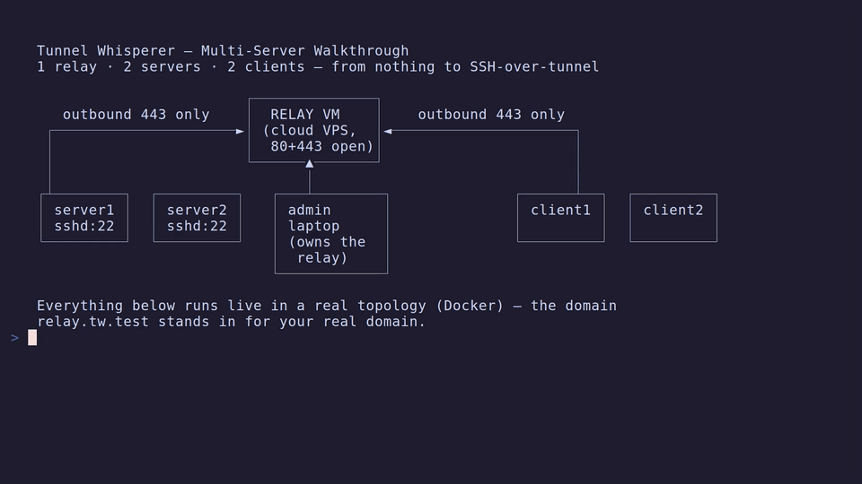

<p align="center">
  
</p>

<h1 align="center">Tunnel Whisperer</h1>

<p align="center"><strong>Surgical, resilient connectivity for restrictive enterprise environments.</strong></p>

<p align="center">
  <a href="https://github.com/Tunnel-Whisperer/Tunnel-Whisperer/actions/workflows/release.yml"></a>
  <a href="https://github.com/Tunnel-Whisperer/Tunnel-Whisperer"></a>
  <a href="LICENSE"></a>
</p>

Tunnel Whisperer creates **resilient, application-layer bridges** for specific ports across separated private networks. It encapsulates traffic in standard HTTPS to traverse firewalls, NAT, and Deep Packet Inspection (DPI).

> **[Full Documentation](https://tunnel-whisperer.github.io/Tunnel-Whisperer)** — getting started, guides, architecture, API reference, and more.

---

## The Problem: "The Connectivity Gap"

In modern enterprise environments (Healthcare, Manufacturing, Finance), connectivity is blocked by rigid network policies:

1. **Strict Egress Rules:** Firewalls block everything except Port 443 (HTTPS). SSH, OpenVPN, and WireGuard are dropped.
2. **Legacy Devices:** MRI scanners, industrial PLCs, and old servers cannot install modern VPN clients.
3. **DPI Interference:** "Next-Gen" firewalls detect and kill non-web traffic even on Port 443.

**Tunnel Whisperer bridges this gap.** It wraps TCP traffic inside a genuine TLS-encrypted HTTPS stream using Xray's VLESS+XHTTP protocol. To the network, it looks exactly like standard web traffic.

---

## Use Cases

### Healthcare Interoperability (DICOM/HL7)

Forward DICOM port 104 from a hospital scanner to a cloud AI platform — through a firewall that only allows HTTPS. Deploy a gateway on the scanner's LAN; the scanner sends to `localhost`, and the tunnel delivers it to the cloud.

### Vendor Remote Support (OT/IoT)

Give a vendor surgical access to a single maintenance port on a factory-floor PLC — without VPN, without inbound firewall rules, without exposing the rest of the network.

### Developer & Data Science Workflows

Connect a cloud Jupyter notebook to an on-premise database behind a corporate firewall. Query `localhost:5432` as if the database were local.

---

## Architecture

```
Client Network                   Public Cloud                    Server Network
+------------------+         +------------------+         +------------------+
| tw client connect|- HTTPS ->|    Relay VM     |<- HTTPS -| tw server start  |
|                  |  (Xray   |                 |  (Xray   |                  |
| local ports      |  VLESS + |  Caddy :443     |  VLESS + | SSH server :2222 |
| :5432 :3389      |  XHTTP + |  mTLS gate      |  XHTTP + |                  |
|                  |  mTLS)   |  Xray (loopback,|  mTLS)   |                  |
|                  |          |   per-tenant)   |          |                  |
|  SSH ------------+----------+-----------------+----------+-> port forward   |
|  (over Xray)     |          |  SSH: tunnel-   |          |   -> services    |
+------------------+          |  only by default|          +------------------+
                              |  Firewall: 80+443|
                              +------------------+
```

1. **Transport:** Xray VLESS + XHTTP + mutual TLS on port 443 — indistinguishable from regular HTTPS
2. **Relay:** Lightweight cloud VM (Hetzner, DigitalOcean, or AWS — or any VPS via the generated install script) with Caddy (TLS/ACME) and Xray. Caddy enforces mutual TLS (`client_auth require_and_verify`) against a per-tenant CA, so only certificate-bearing servers are admitted. Multi-tenant: one relay serves many servers, each isolated behind its own CA, UUID, and port. SSH is tunnel-only unless provisioned with `--ssh-open`.
3. **Tunnel:** Embedded SSH server (Go `x/crypto/ssh`) handles port forwarding, encryption, and per-user auth

**Key properties:**
- Zero inbound ports — all connections outbound to :443
- Mutual-TLS relay admission — a per-tenant X.509 client certificate is required at the TLS handshake
- End-to-end SSH encryption — the relay never sees plaintext
- Per-user port lockdown via `permitopen` in `authorized_keys`
- Automatic reconnection with gradual backoff (2s → 30s max)

> See [Architecture Documentation](https://tunnel-whisperer.github.io/Tunnel-Whisperer/architecture/) for sequence diagrams, component views, and deployment details.

---

## Three Roles, One Binary

Every machine runs the same `tw` binary in one of three modes (set by its first role command, then signed and enforced):

- **Relay (admin):** owns the relay VM — provisions it, enrolls/removes server tenants, holds the keys.
- **Server:** joins a relay as a tenant, publishes its reverse tunnel, manages client users.
- **Client:** imports a user bundle and opens local ports that reach the server's services.

## Quick Start: One Relay, One Server, One Client

The smallest setup — one relay, one server, one client:

```bash
# ── Admin laptop: provision the relay (cloud wizard, or any VPS manually) ──
tw relay create --provider manual --domain relay.example.com --ip <vps-ip>
#   → run the emitted tw-install-relay.example.com.sh as root on the VPS,
#     point DNS relay.example.com → <vps-ip>
tw relay test                          # DNS → HTTPS/mTLS → SSH-over-tunnel

# ── server: join the relay ──
tw server join-relay relay.example.com # writes tw_join_<id>.json → send to admin
# admin: tw relay enroll-server tw_join_<id>.json   → send response back
tw server join-relay --apply tw_join_response_<id>.json
tw server start                        # or: sudo tw service install && sudo tw service start

# ── server: grant the client access to its SSH (port 22 → client's local 2201) ──
tw server user create alice -m 2201:22
tw server user apply alice
tw config export-user alice            # → alice-tw-context.twctx, send over a trusted channel

# ── client: import and connect ──
tw config import alice-tw-context.twctx --activate
tw client connect
ssh -p 2201 user@127.0.0.1             # you are on the server, through the relay
```

> **Scaling out?** The relay is multi-tenant, and enrollment is live — adding a server never restarts the relay or interrupts the others. The [Multi-Server Walkthrough](https://tunnel-whisperer.github.io/Tunnel-Whisperer/guides/multi-server-walkthrough/) covers 1 relay, 2 servers, 2 clients across five machines — with step-by-step videos, how one client reaches *both* servers by switching kubectl-style contexts (`tw config use-context`), and the gotchas (modes are permanent per machine, bundles are unprotected, re-export after editing mappings). The whole thing, recorded live in a real topology (~3 min, silent):

[](https://tunnel-whisperer.github.io/Tunnel-Whisperer/guides/multi-server-walkthrough/)

Building from source requires **Go 1.26+**; **Terraform** only for cloud relay provisioning (`make build` → `bin/tw`).

---

## CLI Commands

Structured by role — with dynamic tab completion for contexts, users, and server-ids (`source <(tw completion)`).

| Command | Description |
|---------|-------------|
| **Relay (admin)** | |
| `tw relay create` | Provision a relay: cloud wizard (Hetzner/DigitalOcean/AWS) or `--provider manual --domain --ip [--ssh-open]` |
| `tw relay enroll-server <join.json>` | Enroll a joining server as a live tenant (no relay restart) |
| `tw relay get-servers` | List tenants with live TUNNEL up/down state |
| `tw relay un-enroll-server <id>` | Totally remove a tenant — config and live connections |
| `tw relay ssh` / `test` / `status` / `destroy` | Shell over the tunnel, 3-step diagnostic, status, teardown |
| **Server** | |
| `tw server join-relay <host>` | Generate a join-request; `--apply` the admin's response |
| `tw server start` / `test` / `status` | Run the daemon (SSH server, tunnel, gRPC API, dashboard) |
| `tw server user create/apply/list/edit/delete/unregister` | Per-user port grants; revocation is live, no restart |
| `tw server app list/create/edit/delete` | Reusable port-mapping templates |
| **Client** | |
| `tw client connect` / `listen` / `test` / `status` | Open the tunnel and local ports from the imported bundle |
| **Global** | |
| `tw status` | Unified status: active context, mode, live state (any role) |
| `tw config get-contexts / use-context <name\|id> / import / export / export-user ...` | kubectl-style contexts: many relays/identities per machine |
| `tw dashboard` | Web dashboard (role-aware: tenant management, users, contexts, stats) |
| `tw proxy set/clear` | Outbound SOCKS5/HTTP proxy for all tunnel traffic |
| `tw service install/start/stop/uninstall` | Native service (Linux systemd / Windows SCM / macOS launchd) |
| `tw completion` | zsh completion with live object completion |

> See [CLI Reference](https://tunnel-whisperer.github.io/Tunnel-Whisperer/reference/cli/) for details and flags.

---

## Security Model

| Layer | Standard | Purpose |
| ----- | -------- | ------- |
| TLS 1.3 + mTLS | Industry standard + X.509 | Encrypts all data in transit; admits only certificate-bearing connections at the relay |
| VLESS + XHTTP | Tunnel protocol | Tags users, obfuscates traffic patterns (defense-in-depth) |
| Ed25519 SSH | Elliptic curve cryptography | Authenticates endpoints, restricts per-user access |

- **Mutual-TLS admission** — a per-tenant CA-issued client certificate gates the relay at the TLS handshake
- **Zero plaintext** leaves the local network
- **No signing keys** on the relay — it holds only public CA certificates; compromise does not expose user data
- **Least privilege** — each user can only forward to explicitly allowed ports; tenant keys on the relay are forwarding-only (no shell), pinned to the tunnel
- **Dynamic keys** — add/revoke users without restarting the server (authorized_keys re-read on every auth)
- **Signed roles** — each machine's mode (relay/server/client) is ed25519-signed by its issuer; tampering is detected
- **SSH your way** — relay SSH is tunnel-only by default; `--ssh-open` deliberately opens port 22 for the admin key, closable later from the dashboard

> See [Security Documentation](https://tunnel-whisperer.github.io/Tunnel-Whisperer/security/) for encryption details, access control, and compliance properties.

---

## Market Comparison

| Feature | **Tunnel Whisperer** | **Standard VPNs** (Tailscale/WireGuard) | **Reverse Proxies** (Ngrok) |
| :--- | :--- | :--- | :--- |
| **Connectivity** | Surgical (port-to-port) | Broad (host-to-host) | Public (port-to-web) |
| **Network Compatibility** | High (DPI-resistant HTTPS) | Low (UDP/standard ports often blocked) | Medium (standard HTTPS) |
| **Deployment Target** | Gateway / sidecar (connects *other* devices) | Host-based (connects *this* device) | Dev/test (temporary exposure) |
| **Infrastructure** | Self-hosted (you own data/keys) | SaaS / hybrid | SaaS |
| **Primary Goal** | Production reliability in strict networks | Mesh networking | Public access |
