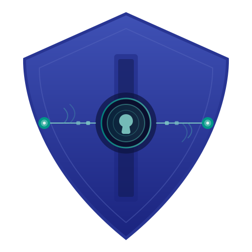
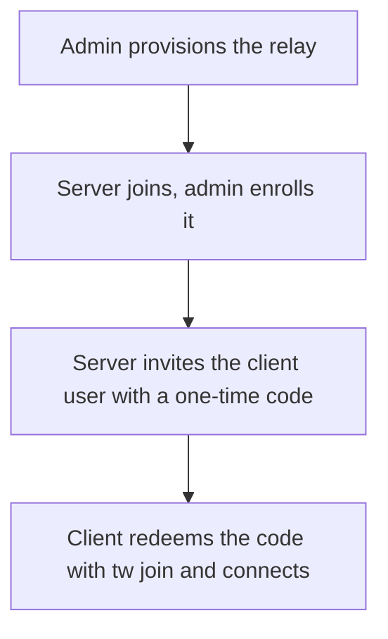
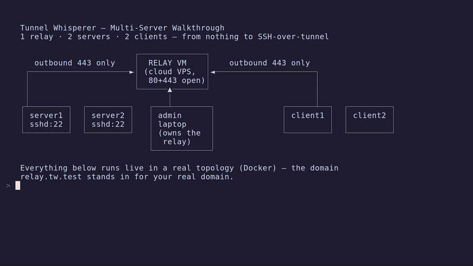
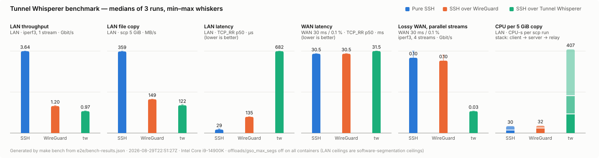

<p align="center">
  
</p>

<h1 align="center">Tunnel Whisperer</h1>

<p align="center"><strong>Surgical, resilient connectivity for restrictive enterprise environments.</strong></p>

<p align="center">
  <a href="https://github.com/Tunnel-Whisperer/Tunnel-Whisperer/actions/workflows/release.yml"></a>
  <a href="https://github.com/Tunnel-Whisperer/Tunnel-Whisperer"></a>
  <a href="LICENSE"></a>
</p>

Tunnel Whisperer creates **resilient, application-layer bridges** for specific ports across separated private networks. It encapsulates traffic in standard HTTPS to traverse firewalls, NAT, and Deep Packet Inspection (DPI).

> **[Full Documentation](https://tunnel-whisperer.github.io/Tunnel-Whisperer)** — getting started, guides, architecture, API reference, and more.

---

## Why it's different

Two design choices set Tunnel Whisperer apart from mesh VPNs like **Tailscale**, **NetBird**, and the rest:

- **🔐 Your users' identities never leave your server.** Authorization lives entirely in the on-prem server's `authorized_keys` — SSH public keys with per-user `permitopen` rules, re-read on every connection. **No cloud or third-party control plane ever brokers or stores who your users are.** The relay is a blind forwarder: it holds no credentials, no CA signing keys, and never sees plaintext.
- **🎯 You grant ports, not networks.** A user is allowed exactly the `host:port` targets you specify — nothing else. **There is no virtual network and no routable overlay:** a granted user reaches only the services you opened, never the network they sit on. No subnet exposure, no lateral movement.

| | **Tunnel Whisperer** | **Tailscale** | **NetBird** |
| :--- | :--- | :--- | :--- |
| **Where user identity & authz live** | **Only on your server** (`authorized_keys`) — no external control plane | Coordination plane (SaaS; self-host via Headscale) | Management plane (SaaS or self-hosted) |
| **Unit of access granted** | **A specific `host:port`** | A device on the overlay, ACL-scoped (can include ports) | Peers/networks, policy-scoped |
| **Creates a routable overlay network?** | **No** — port forwards only | Yes (WireGuard mesh) | Yes (WireGuard mesh) |
| **Default reachability** | **Only the exact ports you allow** | Tailnet devices per ACL | Peers/networks per policy |
| **Relay/infra holds keys or sees traffic?** | **No** — no creds, no CA signing keys, end-to-end SSH | Coordination plane holds node keys + ACLs; DERP relays carry encrypted WG | Management/signal plane holds config |
| **Transport** | HTTPS (TLS 1.3 + VLESS/XHTTP) — survives DPI on `:443` | WireGuard (UDP; TCP fallback via DERP) | WireGuard (UDP; relays) |

The same holds against the rest of the category — **ZeroTier**, **Netmaker**, **Twingate**, **Cloudflare Access / Tunnel**, **OpenVPN Cloud**: all of them broker identity and policy through a control plane (cloud, or self-hosted at best), and most hand out overlay/subnet reachability. Even the app-scoped zero-trust ones route your users' identity and traffic through their edge. Tunnel Whisperer keeps **identity on your server** and gives out **nothing but the exact port** — no control plane, no overlay.

Mesh VPNs are excellent at building a private network you join. Tunnel Whisperer is for the opposite need: exposing **one service on one port to one person**, across hostile networks — without a network overlay, and **without handing your user directory to anyone**.

---

## The Problem: "The Connectivity Gap"

In modern enterprise environments (Healthcare, Manufacturing, Finance), connectivity is blocked by rigid network policies:

1. **Strict Egress Rules:** Firewalls block everything except Port 443 (HTTPS). SSH, OpenVPN, and WireGuard are dropped.
2. **Legacy Devices:** MRI scanners, industrial PLCs, and old servers cannot install modern VPN clients.
3. **DPI Interference:** "Next-Gen" firewalls detect and kill non-web traffic even on Port 443.

**Tunnel Whisperer bridges this gap.** It wraps TCP traffic inside a genuine TLS-encrypted HTTPS stream using Xray's VLESS+XHTTP protocol. To the network, it looks exactly like standard web traffic.

---

## Use Cases

### Healthcare Interoperability (DICOM/HL7)

Forward DICOM port 104 from a hospital scanner to a cloud AI platform — through a firewall that only allows HTTPS. Deploy a gateway on the scanner's LAN; the scanner sends to `localhost`, and the tunnel delivers it to the cloud.

### Vendor Remote Support (OT/IoT)

Give a vendor surgical access to a single maintenance port on a factory-floor PLC — without VPN, without inbound firewall rules, without exposing the rest of the network.

### Developer & Data Science Workflows

Connect a cloud Jupyter notebook to an on-premise database behind a corporate firewall. Query `localhost:5432` as if the database were local.

---

## Architecture

```
Client Network                   Public Cloud                    Server Network
+------------------+         +------------------+         +------------------+
| tw client connect|- HTTPS ->|    Relay VM     |<- HTTPS -| tw server start  |
|                  |  (Xray   |                 |  (Xray   |                  |
| local ports      |  VLESS + |  Caddy :443     |  VLESS + | SSH server :2222 |
| :5432 :3389      |  XHTTP + |  mTLS gate      |  XHTTP + |                  |
|                  |  mTLS)   |  Xray (loopback,|  mTLS)   |                  |
|                  |          |   per-tenant)   |          |                  |
|  SSH ------------+----------+-----------------+----------+-> port forward   |
|  (over Xray)     |          |  SSH: tunnel-   |          |   -> services    |
+------------------+          |  only by default|          +------------------+
                              |  Firewall: 80+443|
                              +------------------+
```

1. **Transport:** Xray VLESS + XHTTP + mutual TLS on port 443 — indistinguishable from regular HTTPS
2. **Relay:** Lightweight cloud VM (Hetzner, DigitalOcean, or AWS — or any VPS via the generated install script) with Caddy (TLS/ACME) and Xray. Caddy enforces mutual TLS (`client_auth require_and_verify`) against a per-tenant CA, so only certificate-bearing servers are admitted. Multi-tenant: one relay serves many servers, each isolated behind its own CA, UUID, and port. SSH is tunnel-only unless provisioned with `--ssh-open`.
3. **Tunnel:** Embedded SSH server (Go `x/crypto/ssh`) handles port forwarding, encryption, and per-user auth

**Key properties:**
- Zero inbound ports — all connections outbound to :443
- Mutual-TLS relay admission — a per-tenant X.509 client certificate is required at the TLS handshake
- End-to-end SSH encryption — the relay never sees plaintext
- Per-user port lockdown via `permitopen` in `authorized_keys`
- Automatic reconnection with gradual backoff (2s → 30s max)

> See [Architecture Documentation](https://tunnel-whisperer.github.io/Tunnel-Whisperer/architecture/) for sequence diagrams, component views, and deployment details.

---

## Three Roles, One Binary

Every machine runs the same `tw` binary in one of three modes (set by its first role command, then signed and enforced):

- **Relay (admin):** owns the relay VM — provisions it, enrolls/removes server tenants, holds the keys.
- **Server:** joins a relay as a tenant, publishes its reverse tunnel, manages client users.
- **Client:** enrolls with `tw join` against a spoken invite code and opens local ports that reach the server's services.

## Quick Start: One Relay, One Server, One Client

The smallest setup — one relay, one server, one client:


```mermaid
flowchart TD
    S1["Admin provisions the relay"]
    S2["Server joins, admin enrolls it"]
    S3["Server invites the client user with a one-time code"]
    S4["Client redeems the code with tw join and connects"]
    S1 --> S2 --> S3 --> S4
```

```bash
# ── Admin laptop: provision the relay (cloud wizard, or any VPS manually) ──
tw relay create --provider manual --domain relay.example.com --ip <vps-ip>
#   → run the emitted tw-install-relay.example.com.sh as root on the VPS,
#     point DNS relay.example.com → <vps-ip>
tw relay test                          # DNS → HTTPS/mTLS → SSH-over-tunnel

# ── server: join the relay (admin runs `tw relay invite`, reads you the code) ──
tw join relay.example.com <code>       # SAS spoken check on both sides

# ── server: grant the client access to its SSH (port 22 → client's local 2201) ──
tw server user invite alice -m 2201:22 # mints a one-time code; read it to alice
tw server start                        # or: sudo tw service install && sudo tw service start

# ── client: redeem the invite and connect ──
tw join relay.example.com <code>       # keys are born locally; context stored ready-to-run
tw client connect
ssh -p 2201 user@127.0.0.1             # you are on the server, through the relay
```

> **Scaling out?** The relay is multi-tenant, and enrollment is live — adding a server never restarts the relay or interrupts the others. The [Multi-Server Walkthrough](https://tunnel-whisperer.github.io/Tunnel-Whisperer/guides/multi-server-walkthrough/) covers 1 relay, 2 servers, 2 clients across five machines — with step-by-step videos, how one client reaches *both* servers by switching kubectl-style contexts (`tw config use-context`), and the gotchas (modes are permanent per machine, port mappings are fixed at enrollment — delete + re-invite to change them, invite codes are single-use and short-lived). The whole thing, recorded live in a real topology (~3 min, silent):

[](https://tunnel-whisperer.github.io/Tunnel-Whisperer/guides/multi-server-walkthrough/)

Building from source requires **Go 1.26+**; **Terraform** only for cloud relay provisioning (`make build` → `bin/tw`).

---

## CLI Commands

Structured by role — with dynamic tab completion for contexts, users, and server-ids (`source <(tw completion)`).

| Command | Description |
|---------|-------------|
| **Relay (admin)** | |
| `tw relay create` | Provision a relay: cloud wizard (Hetzner/DigitalOcean/AWS) or `--provider manual --domain --ip [--ssh-open]` |
| `tw relay invite` / `add-server` | Enroll a joining server over a one-time code (SAS-confirmed) / self-enroll this machine |
| `tw relay get-servers` | List tenants with live TUNNEL up/down state |
| `tw relay un-enroll-server <id>` | Totally remove a tenant — config and live connections |
| `tw relay ssh` / `test` / `status` / `destroy` | Shell over the tunnel, 3-step diagnostic, status, teardown |
| **Server** | |
| `tw join <relay-host> <code>` | Redeem an admin's invite — becomes a server or client per the issuer's grant |
| `tw server start` / `test` / `status` | Run the daemon (SSH server, tunnel, gRPC API, dashboard) |
| `tw server user invite/apply/list/single-session/delete/unregister` | Per-user port grants; revocation is live, no restart |
| `tw server app list/create/edit/delete` | Reusable port-mapping templates |
| **Client** | |
| `tw client connect` / `listen` / `set-port` / `test` / `status` | Open the tunnel and the local ports granted at enrollment |
| **Global** | |
| `tw status` | Unified status: active context, mode, live state (any role) |
| `tw config get-contexts / use-context <name\|id> / import / export ...` | kubectl-style contexts: many relays/identities per machine |
| `tw dashboard` | Web dashboard (role-aware: tenant management, users, contexts, stats) |
| `tw proxy set/clear` | Outbound SOCKS5/HTTP proxy for all tunnel traffic |
| `tw service install/start/stop/uninstall` | Native service (Linux systemd / Windows SCM / macOS launchd) |
| `tw completion` | zsh completion with live object completion |

> See [CLI Reference](https://tunnel-whisperer.github.io/Tunnel-Whisperer/reference/cli/) for details and flags.

---

## Security Model

| Layer | Standard | Purpose |
| ----- | -------- | ------- |
| TLS 1.3 + mTLS | Industry standard + X.509 | Encrypts all data in transit; admits only certificate-bearing connections at the relay |
| VLESS + XHTTP | Tunnel protocol | Tags users, obfuscates traffic patterns (defense-in-depth) |
| Ed25519 SSH | Elliptic curve cryptography | Authenticates endpoints, restricts per-user access |

- **Mutual-TLS admission** — a per-tenant CA-issued client certificate gates the relay at the TLS handshake
- **Zero plaintext** leaves the local network
- **No signing keys** on the relay — it holds only public CA certificates; compromise does not expose user data
- **Least privilege** — each user can only forward to explicitly allowed ports; tenant keys on the relay are forwarding-only (no shell), pinned to the tunnel
- **Dynamic keys** — add/revoke users without restarting the server (authorized_keys re-read on every auth)
- **Signed roles** — each machine's mode (relay/server/client) is ed25519-signed by its issuer; tampering is detected
- **SSH your way** — relay SSH is tunnel-only by default; `--ssh-open` deliberately opens port 22 for the admin key, closable later from the dashboard

> See [Security Documentation](https://tunnel-whisperer.github.io/Tunnel-Whisperer/security/) for encryption details, access control, and compliance properties.

---

## Market Comparison

| Feature | **Tunnel Whisperer** | **Standard VPNs** (Tailscale/WireGuard) | **Reverse Proxies** (Ngrok) |
| :--- | :--- | :--- | :--- |
| **User identity store** | On your server (`authorized_keys`), on-prem — no control plane | Cloud or self-hosted control plane | SaaS account |
| **Access granularity** | A specific port only | Whole network / host (overlay) | A single public endpoint |
| **Connectivity** | Surgical (port-to-port) | Broad (host-to-host) | Public (port-to-web) |
| **Network Compatibility** | High (DPI-resistant HTTPS) | Low (UDP/standard ports often blocked) | Medium (standard HTTPS) |
| **Deployment Target** | Gateway / sidecar (connects *other* devices) | Host-based (connects *this* device) | Dev/test (temporary exposure) |
| **Infrastructure** | Self-hosted (you own data/keys) | SaaS / hybrid | SaaS |
| **Primary Goal** | Production reliability in strict networks | Mesh networking | Public access |

## Performance

Measured with `make bench` on the e2e topology (real relay, real server, real client tunnel) — medians of 3 runs, server → client. The WAN column applies 30 ms RTT and 0.1 % loss split across client and server egress; tw's relay is modelled mid-path, not as an extra hop. At 1 stream all three transports are loss-bound to the same ≈0.03 Gbit/s (indistinguishable at three runs); the 4-stream column below is where a real difference shows up. Full tables, environment and the offload/loss caveats behind these numbers: [Performance](https://tunnel-whisperer.github.io/Tunnel-Whisperer/reference/performance/).

<picture>
  <source media="(prefers-color-scheme: dark)" srcset="docs/assets/bench-chart-dark.svg">
  
</picture>

| Transport | iperf3 1 stream, LAN | iperf3 4 streams, WAN 30 ms / 0.1 % | TCP_RR p99, LAN | TCP_RR p50, WAN 30 ms / 0.1 % | scp 5 GiB, LAN | Wire overhead, LAN | Gbit/s per busy core, LAN | Peak RSS (client / server / relay) |
|---|---|---|---|---|---|---|---|---|
| Pure SSH | 3.64 Gbit/s | 0.10 Gbit/s | 75 µs | 30.5 ms | 359 MB/s | 4.7 % | 1.37 | — / 4.6 MiB (idle sshd) / — |
| SSH over WireGuard (direct peer) | 1.20 Gbit/s | 0.10 Gbit/s | 336 µs | 30.5 ms | 149 MB/s | 9.4 % | 0.29 | 0 (kernel) |
| **SSH over Tunnel Whisperer** (via relay) | 0.97 Gbit/s | 0.03 Gbit/s | 1162 µs | 31.5 ms | 122 MB/s | 6.0 % | 0.12 | 55.6 / 45.8 / 109.8 MiB (caddy + xray) |

tw crosses a relay and wraps traffic in TLS so it passes firewalls that block WireGuard outright; the table shows what that costs. At 4 streams under WAN loss, tw stays flat at its single-stream number because every stream is multiplexed over one outer TCP connection to the relay — a property of the design, not a bug.
