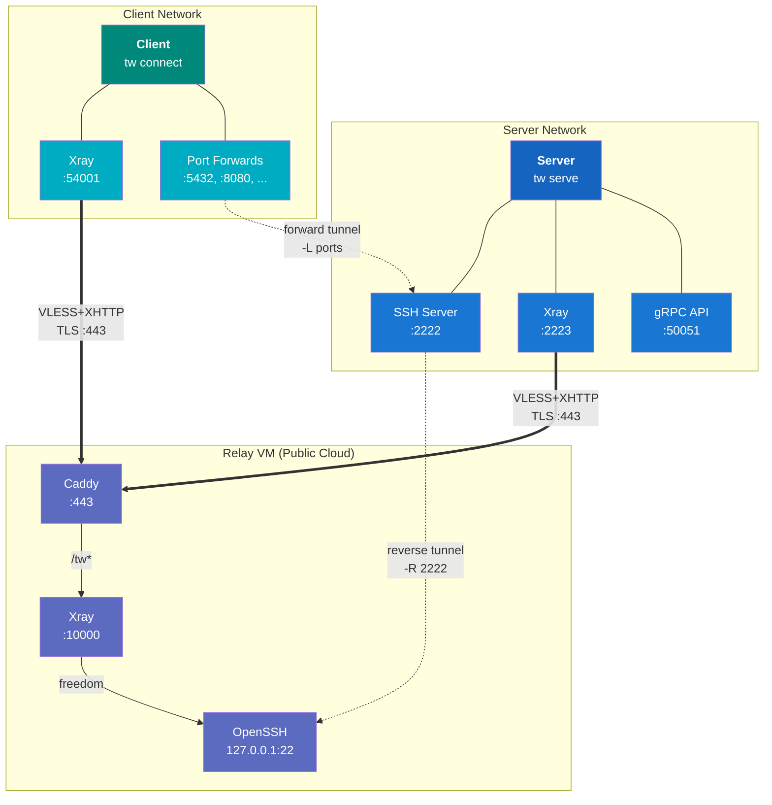
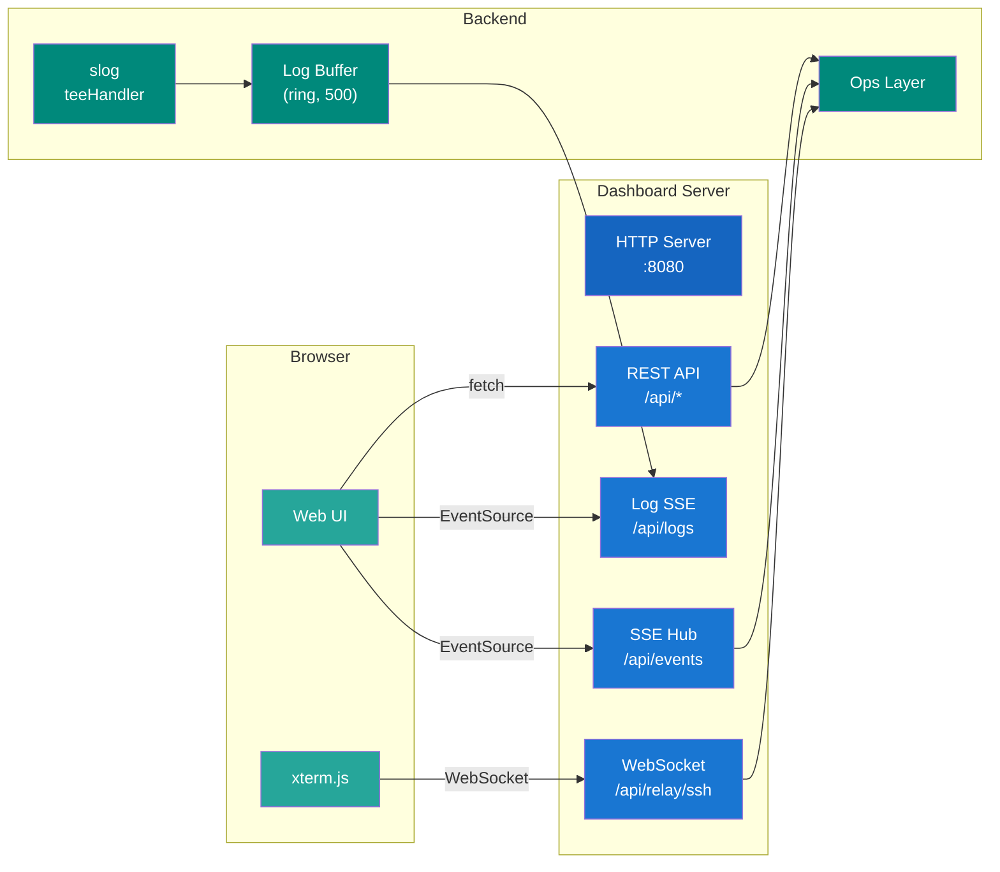

# Building Block View

## Level 1 -- System Overview



### Server (`tw serve`)

The server brings up four internal services:

- **SSH Server** -- an embedded SSH server (Go `golang.org/x/crypto/ssh`) that listens on a configurable port (default `:2222`), supports `direct-tcpip` port forwarding, reads `authorized_keys` dynamically, and enforces `permitopen` restrictions per client key
- **Xray Instance** -- in-process xray-core creating a VLESS+XHTTP+TLS tunnel to the relay; dokodemo-door inbound on `sshPort+1` forwards to the relay's SSH port
- **Reverse Tunnel** -- SSH reverse port forward (`-R`) through Xray, exposing the server's SSH on the relay
- **API Server** -- a gRPC service exposing status and management operations

### Relay

The relay is a lightweight cloud VM provisioned via `tw create relay-server` or the dashboard wizard. It runs:

- **Caddy** -- reverse proxy on `:443`, automatic TLS via Let's Encrypt, forwards `/tw*` to Xray
- **Xray** -- VLESS inbound on `127.0.0.1:10000` with XHTTP transport and freedom outbound, accepts multiple client UUIDs
- **SSH** -- OpenSSH on `127.0.0.1:22` only, accessible exclusively through the Xray tunnel; password authentication disabled
- **Firewall (ufw)** -- only ports 80 and 443 open

Supported cloud providers: **Hetzner**, **DigitalOcean**, **AWS**.

### Client (`tw connect`)

The client starts:

- **Xray Instance** -- in-process xray-core with dokodemo-door inbound on `:54001` forwarding to the server's SSH port on the relay
- **Forward Tunnel** -- SSH local port forwards (`-L`) through Xray, mapping multiple local ports to server services over a single SSH session

### Dashboard (`tw dashboard`)

The dashboard is a web UI served by an embedded HTTP server. It provides:

- **Tee Handler** -- wraps the `slog` handler chain to duplicate log records into a ring buffer. The SSE `/api/logs` endpoint streams entries from this buffer to connected browsers in real time.
- **SSE Hub** -- manages progress event sessions for long-running operations (relay provisioning, user creation, server start/stop). Each operation gets a unique session ID; the browser subscribes via `/api/events/{id}`.
- **WebSocket SSH Terminal** -- the `/api/relay/ssh` endpoint upgrades to a WebSocket and bridges it to an interactive SSH session on the relay via the Xray tunnel. The browser runs xterm.js to render the terminal. Binary messages carry stdin/stdout data; text messages carry JSON control frames (e.g., terminal resize).
- **Mode-aware UI** -- pages and navigation adapt based on the configured `mode` (server or client). Server-only pages (relay, users) are hidden in client mode.
- **Settings Management** -- the config page exposes all server, client, and Xray settings through form-based editing. Changes are persisted via REST API (`/api/settings/server`, `/api/settings/xray`, `/api/settings/client`) and the config YAML preview auto-refreshes after each save.

#### Dashboard Component Architecture



---

## Level 2 -- Project Structure

```text
tw/
├── cmd/
│   └── tw/                             # binary entry point (main.go)
├── internal/
│   ├── cli/                            # cobra commands
│   │   ├── root.go                     # root command, --log-level flag, requireMode()
│   │   ├── serve.go                    # tw serve
│   │   ├── connect.go                  # tw connect
│   │   ├── create_relay.go             # tw create relay-server (wizard)
│   │   ├── create_user.go              # tw create user (wizard)
│   │   ├── dashboard.go                # tw dashboard
│   │   ├── status.go                   # tw status
│   │   ├── proxy.go                    # tw proxy
│   │   ├── relay_ssh.go                # tw relay-ssh (+ _unix.go / _windows.go)
│   │   ├── test_relay.go              # tw test-relay
│   │   ├── list_users.go              # tw list-users
│   │   ├── delete_user.go             # tw delete-user
│   │   ├── export_user.go             # tw export-user
│   │   ├── edit_user.go               # tw edit user
│   │   ├── apply_users.go             # tw apply users / tw unregister user
│   │   ├── app.go                     # tw app list/create/edit/delete
│   │   ├── destroy_relay.go           # tw destroy-relay
│   │   └── completion.go              # shell completion
│   ├── config/                         # YAML config, platform-specific paths
│   │   └── config.go                   # Load/Save, Dir/RelayDir/UsersDir, FileHash()
│   ├── ops/                            # business logic shared by CLI + dashboard
│   │   ├── ops.go                      # Ops struct, config change detection, lifecycle
│   │   ├── keys.go                     # SSH key management
│   │   ├── setup.go                    # first-run setup
│   │   ├── cloud.go                    # cloud provider credential testing
│   │   ├── user.go                     # user CRUD, online tracking, relay config updates
│   │   ├── client.go                   # clientManager lifecycle (start/stop/reconnect)
│   │   ├── relay.go                    # relay SSH helpers, relay testing
│   │   ├── server.go                   # serverManager lifecycle (start/stop/restart)
│   │   └── terraform.go               # Terraform init/apply/destroy wrappers
│   ├── logging/                        # structured logging
│   │   └── logging.go                  # Setup(), SetLevel(), dynamic slog.LevelVar
│   ├── api/                            # gRPC API service
│   │   ├── server.go                   # gRPC server bootstrap
│   │   ├── service.go                  # service implementation
│   │   ├── handlers.go                 # RPC handlers
│   │   ├── client.go                   # gRPC client for CLI commands
│   │   └── codec.go                    # protobuf codec helpers
│   ├── ssh/                            # SSH key generation, embedded server, tunnels
│   │   ├── server.go                   # embedded SSH server with dynamic auth + permitopen
│   │   ├── client.go                   # SSH client helpers
│   │   ├── forward.go                  # client-side local port forwarding (-L)
│   │   ├── reverse.go                  # server-side reverse port forwarding (-R)
│   │   └── keygen.go                   # ed25519 key pair generation
│   ├── xray/                           # in-process xray-core
│   │   └── xray.go                     # server + client config builders, instance management
│   ├── relay/
│   │   └── terraform/                  # cloud-init + Terraform templates (go:embed)
│   │       ├── cloud-init.yaml.tmpl
│   │       ├── install-script.sh.tmpl  # manual install script template
│   │       ├── aws.tf.tmpl
│   │       ├── hetzner.tf.tmpl
│   │       ├── digitalocean.tf.tmpl
│   │       └── generate.go             # template rendering, XrayVersion constant
│   ├── dashboard/                      # web dashboard
│   │   ├── server.go                   # HTTP server, routes, template parsing
│   │   ├── embed.go                    # go:embed for templates/ and static/
│   │   ├── logbuf.go                   # ring buffer, teeHandler, subscriber support
│   │   ├── handlers_api.go             # REST API (status, config, users, relay, server/client control)
│   │   ├── handlers_sse.go             # SSE hub, progress event streaming
│   │   ├── handlers_ws.go              # WebSocket SSH terminal bridge
│   │   ├── handlers_pages.go           # HTML page handlers (index, relay, users, config)
│   │   ├── templates/
│   │   │   ├── layout.html             # base layout
│   │   │   ├── partials/
│   │   │   │   └── nav.html            # navigation (mode-aware)
│   │   │   └── pages/
│   │   │       ├── index.html          # status overview
│   │   │       ├── setup.html          # first-run setup
│   │   │       ├── config.html         # configuration editor
│   │   │       ├── relay.html          # relay management
│   │   │       ├── relay_wizard.html   # relay provisioning wizard
│   │   │       ├── users.html          # user list
│   │   │       ├── user_new.html       # create user form
│   │   │       ├── user_detail.html    # user detail + download
│   │   │       ├── user_edit.html      # edit user port mappings
│   │   │       ├── apps.html           # application template list
│   │   │       ├── app_new.html        # create application template
│   │   │       └── app_edit.html       # edit application template
│   │   └── static/
│   │       ├── css/
│   │       │   ├── style.css
│   │       │   └── xterm.min.css
│   │       └── js/
│   │           ├── app.js              # shared utilities, SSE helpers
│   │           ├── status.js           # status page logic
│   │           ├── config.js           # config page logic
│   │           ├── relay.js            # relay page logic
│   │           ├── users.js            # users page logic
│   │           ├── apps.js            # apps page logic
│   │           └── vendor/
│   │               ├── xterm.min.js
│   │               └── xterm-addon-fit.min.js
│   └── provider/                       # cloud provider abstraction (stubs)
├── proto/                              # gRPC protobuf definitions
│   └── api/v1/
│       └── service.proto
├── docs/
│   └── architecture/
├── go.mod
├── go.sum
└── Makefile
```
