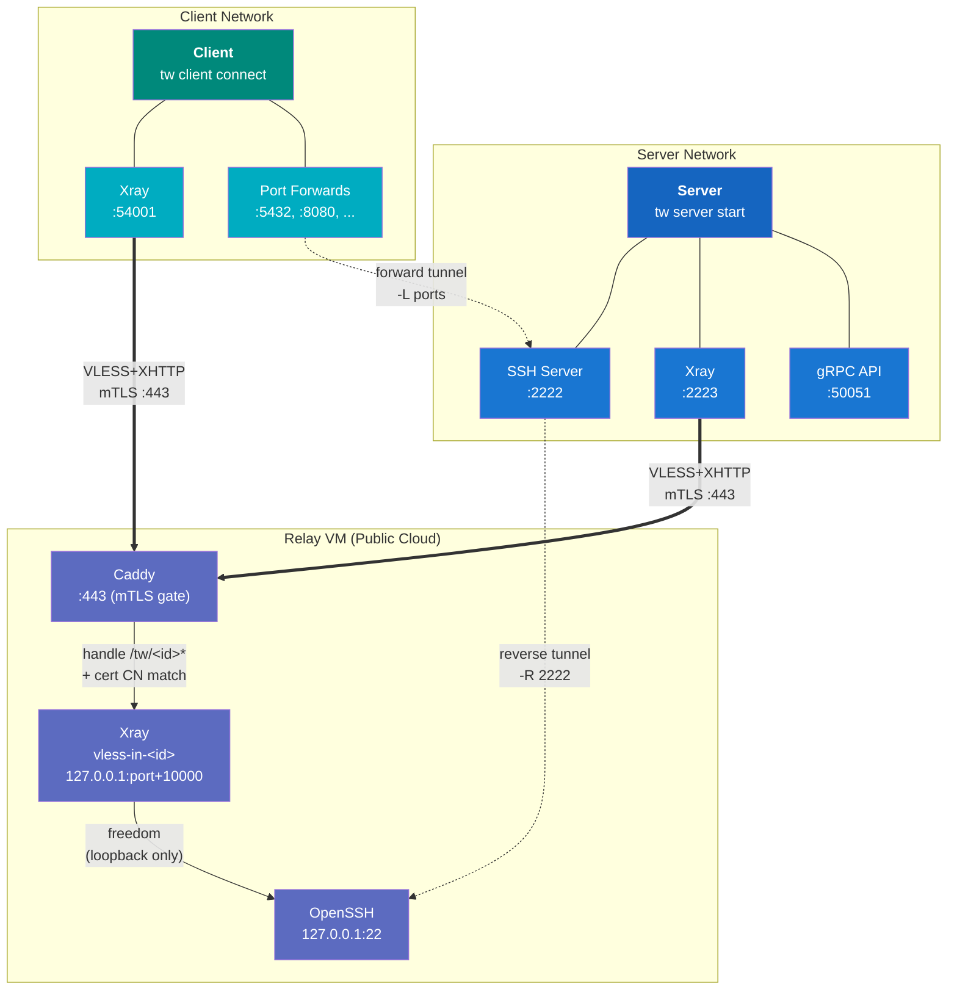
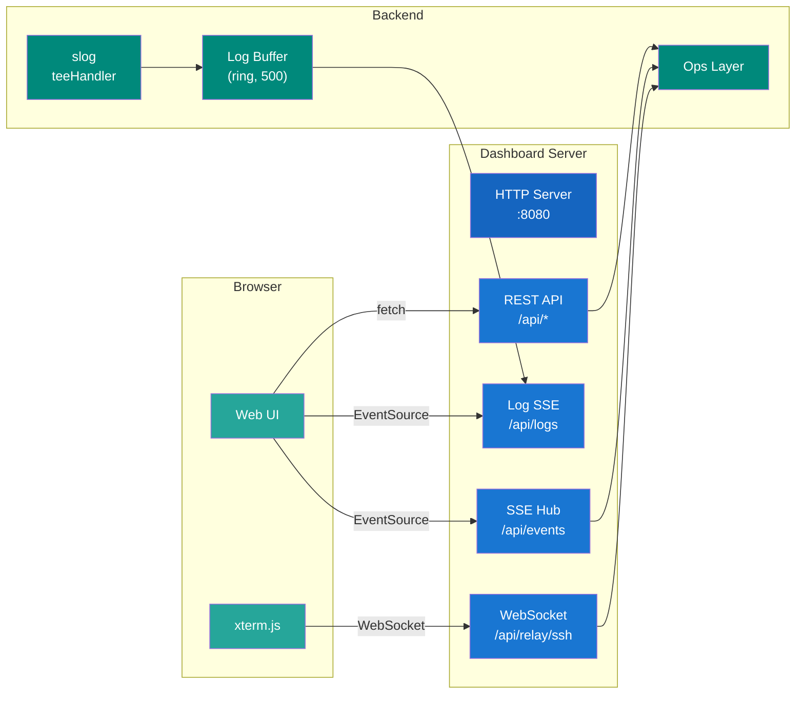

# Building Block View

## Level 1 -- System Overview


```mermaid
graph TB
    subgraph SN["Server Network"]
        S["<b>Server</b><br/>tw server start"]
        SSHD["SSH Server<br/>:2222"]
        XS["Xray<br/>:2223"]
        API["gRPC API<br/>:50051"]
        S --- SSHD
        S --- XS
        S --- API
    end

    subgraph RELAY["Relay VM (Public Cloud)"]
        CADDY["Caddy<br/>:443 (mTLS gate)"]
        XR["Xray<br/>vless-in-&lt;id&gt;<br/>127.0.0.1:port+10000"]
        OSSH["OpenSSH<br/>127.0.0.1:22"]
        CADDY -->|"handle /tw/&lt;id&gt;*<br/>+ cert CN match"| XR
        XR -->|"freedom<br/>(loopback only)"| OSSH
    end

    subgraph CN["Client Network"]
        CL["<b>Client</b><br/>tw client connect"]
        XC["Xray<br/>:54001"]
        FWD["Port Forwards<br/>:5432, :8080, ..."]
        CL --- XC
        CL --- FWD
    end

    XS ==>|"VLESS+XHTTP<br/>mTLS :443"| CADDY
    XC ==>|"VLESS+XHTTP<br/>mTLS :443"| CADDY
    SSHD -.->|"reverse tunnel<br/>-R 2222"| OSSH
    FWD -.->|"forward tunnel<br/>-L ports"| SSHD

    style S fill:#1565C0,color:#fff
    style CL fill:#00897B,color:#fff
    style CADDY fill:#5C6BC0,color:#fff
    style XR fill:#5C6BC0,color:#fff
    style OSSH fill:#5C6BC0,color:#fff
    style SSHD fill:#1976D2,color:#fff
    style XS fill:#1976D2,color:#fff
    style API fill:#1976D2,color:#fff
    style XC fill:#00ACC1,color:#fff
    style FWD fill:#00ACC1,color:#fff
```

### Server (`tw server start`)

The server brings up its internal services:

- **SSH Server** -- an embedded SSH server (Go `golang.org/x/crypto/ssh`) that listens on a configurable port (default `:2222`), supports `direct-tcpip` port forwarding, reads `authorized_keys` dynamically, and enforces `permitopen` (and optional `single-session`) restrictions per client key
- **Xray Instance** -- in-process xray-core creating a VLESS+XHTTP+mTLS tunnel to the relay on the server's own path `/tw/<server-id>`; presents the per-server X.509 client certificate (`usage: "client-cert"`, CN = server-id) so the relay's Caddy `client_auth` gate admits it; dokodemo-door inbound on `sshPort+1` (or `server.xray_port`) forwards to the relay's SSH port
- **Reverse Tunnel** -- SSH reverse port forward (`-R`) through Xray, exposing the server's SSH on the relay at its admin-assigned `remote_port`
- **Per-server CA** -- a small certificate authority (`internal/pki`) generated on first run that issues the client certificate presented at the relay; the CA public certificate is shipped to the relay's trust pool (at provisioning for the admin's own entry, at enrollment for joined servers), the signing key never leaves the server
- **API Server** -- a gRPC service exposing status and management operations (`:50051`)
- **Dashboard** -- started alongside the server when `server.dashboard_port` is set

A server that is not the relay's admin joins via `tw server join-relay <relay-host>` (emits a `join-request.json` of public material), is enrolled by the admin (`tw relay enroll-server`), and applies the returned `join-response.json` with `tw server join-relay --apply`.

### Relay

The relay is a lightweight VM provisioned by the admin machine (mode `relay`) via `tw relay create` — through Terraform on a cloud provider, or via a generated install script on a bring-your-own VM ("manual" provider). It runs:

- **Caddy** -- reverse proxy on `:443`, automatic server TLS via Let's Encrypt, **mutual TLS** (`client_auth require_and_verify`, TLS 1.3 only) verifying client certificates against a trust pool holding one CA per tenant. Each tenant gets a `handle` block matching *both* its path (`/tw/<server-id>*`) *and* its certificate CN (`CN=<server-id>`), proxying h2c to that tenant's loopback VLESS inbound; anything else gets a 404. This is the relay's admission gate — see [Relay Authentication](../security/relay-authentication.md)
- **Xray** (standalone, pinned version) -- one `vless-in-<server-id>` inbound per tenant on `127.0.0.1:<remote-port>+10000` with XHTTP transport, an `api-in` dokodemo inbound on `127.0.0.1:10085` exposing `HandlerService`/`StatsService`/`RoutingService`, a freedom outbound whose `finalRules` allow loopback destinations only, and per-tenant allow (ports `22,<remote-port>`) / deny (blackhole) routing rules
- **SSH** -- OpenSSH on `127.0.0.1:22` (`--ssh-open` provisions it on `0.0.0.0` instead); password authentication disabled. The tw-managed `authorized_keys` holds the admin's key (pinned `from="127.0.0.1"` unless `--ssh-open`) plus one restricted line per tenant (`from="127.0.0.1",restrict,port-forwarding,permitopen=<sentinel>,permitlisten=<own remote-port>`) — only the admin can shell in; tenants can only publish their own reverse tunnel
- **Firewall (ufw)** -- only ports 80 and 443 open (plus 22 with `--ssh-open`)

Supported cloud providers: **Hetzner**, **DigitalOcean**, **AWS** — plus **Manual** (bring your own VM).

### Client (`tw client connect`)

The client starts:

- **Xray Instance** -- in-process xray-core with dokodemo-door inbound on `:54001` (`client.xray_port`) forwarding to the server's remote SSH port on the relay
- **Forward Tunnel** -- SSH local port forwards (`-L`) through Xray, mapping multiple local ports to server services over a single SSH session; listeners bind `client.listen_address` (default `127.0.0.1`)

Clients receive their identity as a sealed context bundle exported by the server (`tw config export-user`) and import it with `tw config import` — contexts are kubectl-style profiles switched with `tw config use-context`.

### Dashboard (`tw dashboard`)

The dashboard is a web UI served by an embedded HTTP server. It provides:

- **Tee Handler** -- wraps the `slog` handler chain to duplicate log records into a ring buffer. The SSE `/api/logs` endpoint streams entries from this buffer to connected browsers in real time.
- **SSE Hub** -- manages progress event sessions for long-running operations (relay provisioning, user creation, server start/stop). Each operation gets a unique session ID; the browser subscribes via `/api/events/{id}`.
- **WebSocket SSH Terminal** -- the `/api/relay/ssh` endpoint upgrades to a WebSocket and bridges it to an interactive SSH session on the relay via the Xray tunnel. The browser runs xterm.js to render the terminal. Binary messages carry stdin/stdout data; text messages carry JSON control frames (e.g., terminal resize).
- **Mode-aware UI** -- pages and navigation adapt based on the configured `mode` (`relay`, `server`, or `client`). Relay-only pages (relay provisioning, enrolled servers) and server-only pages (users, apps) are hidden in the other roles. Admin enroll/un-enroll actions remain CLI-only.
- **Settings Management** -- the config page exposes all server, client, and Xray settings through form-based editing. Changes are persisted via REST API (`/api/settings/server`, `/api/settings/xray`, `/api/settings/client`) and the config YAML preview auto-refreshes after each save.

#### Dashboard Component Architecture


```mermaid
graph LR
    subgraph Browser
        UI[Web UI]
        XTERM[xterm.js]
    end

    subgraph "Dashboard Server"
        HTTP["HTTP Server<br/>:8080"]
        SSE_HUB["SSE Hub<br/>/api/events"]
        LOG_SSE["Log SSE<br/>/api/logs"]
        WS["WebSocket<br/>/api/relay/ssh"]
        REST["REST API<br/>/api/*"]
    end

    subgraph Backend
        OPS[Ops Layer]
        LOGBUF["Log Buffer<br/>(ring, 500)"]
        SLOG["slog<br/>teeHandler"]
    end

    UI -->|"EventSource"| SSE_HUB
    UI -->|"EventSource"| LOG_SSE
    UI -->|"fetch"| REST
    XTERM -->|"WebSocket"| WS
    REST --> OPS
    SSE_HUB --> OPS
    WS --> OPS
    SLOG --> LOGBUF
    LOGBUF --> LOG_SSE

    style UI fill:#26A69A,color:#fff
    style XTERM fill:#26A69A,color:#fff
    style HTTP fill:#1565C0,color:#fff
    style SSE_HUB fill:#1976D2,color:#fff
    style LOG_SSE fill:#1976D2,color:#fff
    style WS fill:#1976D2,color:#fff
    style REST fill:#1976D2,color:#fff
    style OPS fill:#00897B,color:#fff
    style LOGBUF fill:#00897B,color:#fff
    style SLOG fill:#00897B,color:#fff
```

---

## Level 2 -- Project Structure

```text
tw/
├── cmd/
│   └── tw/                             # binary entry point (main.go)
├── internal/
│   ├── cli/                            # cobra commands, grouped by role
│   │   ├── root.go                     # root command, --log-level/--log-format/--config-dir, requireMode() + mode signature check
│   │   ├── groups.go                   # tw server / tw server user command groups
│   │   ├── relay.go                    # tw relay group (relay role)
│   │   ├── create_relay.go             # tw relay create (wizard; cloud or manual, --ssh-open)
│   │   ├── destroy_relay.go            # tw relay destroy
│   │   ├── relay_enroll.go             # tw relay enroll-server / get-servers
│   │   ├── relay_unenroll.go           # tw relay un-enroll-server
│   │   ├── relay_ssh.go                # tw relay ssh (+ _unix.go / _windows.go)
│   │   ├── serve.go                    # tw server start
│   │   ├── server_join.go              # tw server join-relay (+ --apply)
│   │   ├── create_user.go              # tw server user create (wizard)
│   │   ├── list_users.go               # tw server user list
│   │   ├── delete_user.go              # tw server user delete
│   │   ├── edit_user.go                # tw server user edit
│   │   ├── apply_users.go              # tw server user apply / unregister
│   │   ├── app.go                      # tw server app list/create/edit/delete
│   │   ├── client.go                   # tw client group, tw client listen
│   │   ├── connect.go                  # tw client connect
│   │   ├── test_relay.go               # tw relay|server|client test
│   │   ├── status.go                   # tw status (+ per-role status)
│   │   ├── config.go                   # tw config *-context / import / export / view
│   │   ├── export_user.go              # tw config export-user (client context bundle)
│   │   ├── dashboard.go                # tw dashboard
│   │   ├── proxy.go                    # tw proxy show/set/clear
│   │   ├── service.go                  # tw service install/uninstall/start/stop
│   │   ├── completion.go               # shell completion
│   │   └── coverage_test.go            # fails the build unless e2e/coverage.yaml maps every command
│   ├── config/                         # YAML config, platform-specific paths
│   │   ├── config.go                   # Load/Save, Dir/RelayDir/UsersDir, FileHash(), ModeAuth, CanonicalMode
│   │   └── context.go                  # context index (contexts.yaml), ContextsDir, ShortID
│   ├── pki/                            # per-server CA + client cert issuance (ECDSA P-256)
│   │   └── pki.go                      # GenerateCA(), IssueClientCert()
│   ├── cryptobox/                      # sealed context bundles (argon2id + AES-256-GCM, TWBOX1)
│   ├── auth/                           # auth primitives (Credentials, Claims, JWT provider)
│   ├── ops/                            # business logic shared by CLI + dashboard
│   │   ├── ops.go                      # Ops struct, config change detection, lifecycle
│   │   ├── modeauth/                   # ed25519 signature over (mode, identity) — tamper-evidence
│   │   ├── keys.go                     # SSH key + CA/client-cert management (ensureCerts, applyClientCertPaths)
│   │   ├── identity.go                 # deriveServerID (hostname + UUID short form)
│   │   ├── join.go                     # JoinRequest/JoinResponse, GenerateJoinRequest, ApplyJoinResponse
│   │   ├── enroll.go                   # EnrollServer: registry add + full relay rewrite + gRPC live-add
│   │   ├── unenroll.go                 # UnenrollServer: block re-auth, drop live state, clean files
│   │   ├── registry.go                 # enrolled-server registry (servers/ dir, relay role)
│   │   ├── oplock.go                   # local file lock serializing enroll/un-enroll
│   │   ├── relaygrpc.go                # live tenant add via Xray gRPC (AddInbound/AddRule)
│   │   ├── context.go                  # context list/switch/import/export
│   │   ├── profilebundle.go            # seal/unseal the live profile as a context bundle
│   │   ├── setup.go                    # first-run setup
│   │   ├── cloud.go                    # cloud provider credential testing
│   │   ├── user.go                     # user CRUD, online tracking, relay UUID hot-add/remove
│   │   ├── client.go                   # clientManager lifecycle (start/stop/reconnect)
│   │   ├── relay.go                    # provisioning, relay SSH helpers, manual install script
│   │   ├── server.go                   # serverManager lifecycle (start/stop/restart)
│   │   └── terraform.go                # Terraform init/apply/destroy wrappers
│   ├── logging/                        # structured logging
│   │   └── logging.go                  # Setup(), SetLevel(), dynamic slog.LevelVar
│   ├── api/                            # gRPC API service (JSON codec; proto is documentation only)
│   │   ├── server.go                   # gRPC server bootstrap
│   │   ├── service.go                  # service implementation
│   │   ├── handlers.go                 # RPC handlers
│   │   ├── client.go                   # gRPC client for CLI commands
│   │   └── codec.go                    # JSON gRPC codec
│   ├── ssh/                            # SSH key generation, embedded server, tunnels
│   │   ├── server.go                   # embedded SSH server with dynamic auth + permitopen + single-session
│   │   ├── client.go                   # SSH client helpers
│   │   ├── forward.go                  # client-side local port forwarding (-L)
│   │   ├── reverse.go                  # server-side reverse port forwarding (-R)
│   │   └── keygen.go                   # ed25519 key pair generation
│   ├── stats/                          # opt-in bandwidth analytics (collector, prometheus, counting writers)
│   ├── xray/                           # in-process xray-core
│   │   └── xray.go                     # server + client config builders, instance management
│   ├── relay/
│   │   ├── caddy/                      # relay Caddyfile renderer (mTLS gate + per-tenant handles)
│   │   │   ├── config.go               # RenderCaddyfile(), Server/Config types
│   │   │   └── Caddyfile.tmpl          # client_auth require_and_verify, trust_pool, tls1.3, path+CN matchers
│   │   ├── xray/                       # relay Xray config renderer (multi-tenant)
│   │   │   ├── config.go               # RenderConfig(), Tenant (VlessInPort = remote_port+10000)
│   │   │   ├── relayconfig.json.tmpl   # api-in :10085, per-tenant inbounds/rules, freedom finalRules (loopback only)
│   │   │   └── tenant.go               # single-tenant fragments for the gRPC live-add path
│   │   └── terraform/                  # cloud-init + Terraform templates (go:embed)
│   │       ├── cloud-init.yaml.tmpl
│   │       ├── install-script.sh.tmpl  # manual install script template
│   │       ├── aws.tf.tmpl
│   │       ├── hetzner.tf.tmpl
│   │       ├── digitalocean.tf.tmpl
│   │       └── generate.go             # template rendering, XrayVersion constant
│   ├── dashboard/                      # web dashboard
│   │   ├── server.go                   # HTTP server, routes, template parsing
│   │   ├── embed.go                    # go:embed for templates/ and static/
│   │   ├── logbuf.go                   # ring buffer, teeHandler, subscriber support
│   │   ├── handlers_api.go             # REST API (status, config, users, relay, server/client control)
│   │   ├── handlers_sse.go             # SSE hub, progress event streaming
│   │   ├── handlers_ws.go              # WebSocket SSH terminal bridge
│   │   ├── handlers_pages.go           # HTML page handlers
│   │   ├── templates/
│   │   │   ├── layout.html             # base layout
│   │   │   ├── partials/nav.html       # navigation (mode-aware)
│   │   │   └── pages/                  # index, setup, config, relay, relay_home, relay_wizard,
│   │   │                               # servers, users, user_new/detail/edit, bandwidth, apps, app_new/edit
│   │   └── static/                     # css/ + js/ (app, status, config, relay, servers, users,
│   │                                   # bandwidth, apps) + vendor xterm.js
│   ├── service/                        # native service install/run (systemd / SCM / launchd, build tags)
│   ├── tunnel/                         # near-empty placeholder (real tunneling is internal/ssh over internal/xray)
│   └── version/                        # Version variable (ldflags-injected)
├── proto/                              # gRPC protobuf definitions (documentation only — wire format is JSON)
│   └── api/v1/
│       └── service.proto
├── e2e/                                # full-product e2e suite (Docker Compose, 12 scenarios, `make e2e`)
│   ├── docker-compose.yaml             # relay (systemd) + admin/server/server2/client containers
│   ├── e2e_test.go                     # scenario runner (dependency order)
│   └── coverage.yaml                   # command → scenario map enforced by cli/coverage_test.go
├── docs/
│   └── architecture/
├── go.mod
├── go.sum
└── Makefile
```
