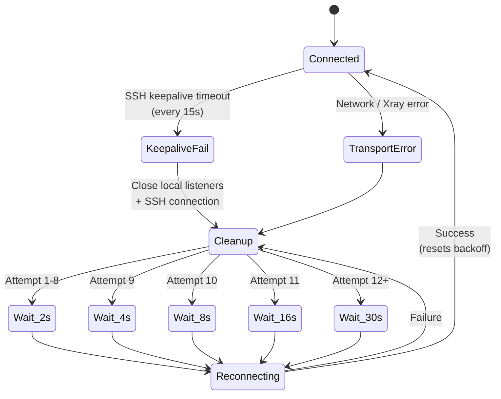
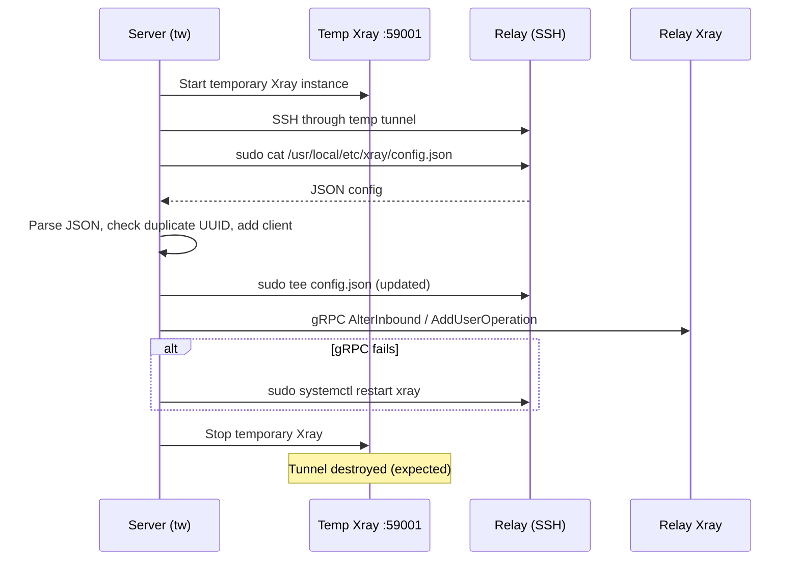
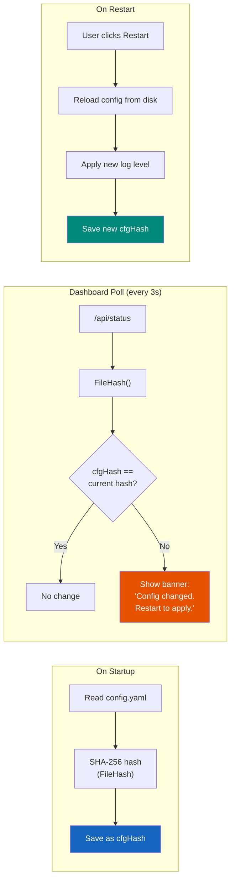
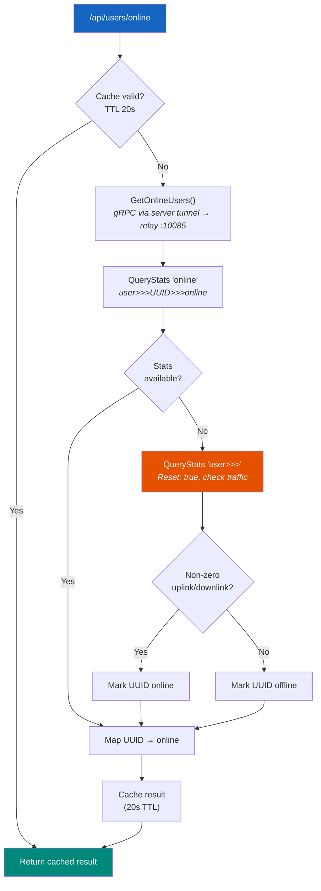
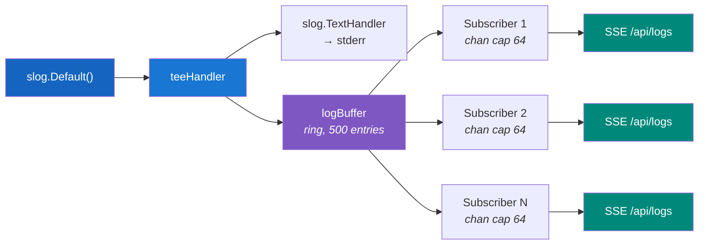
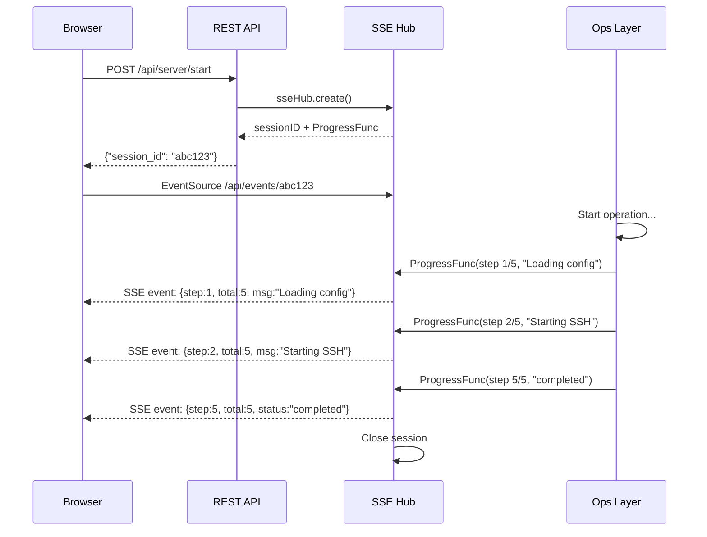
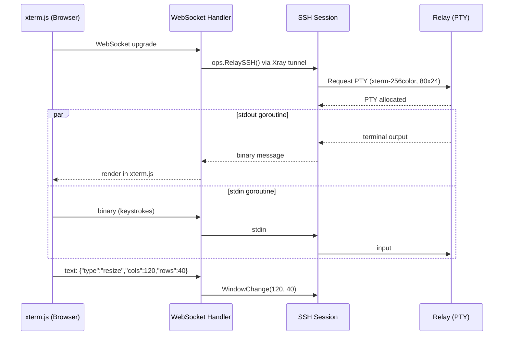

# Cross-cutting Concerns

## Auto-Reconnection



Both the forward tunnel (client) and reverse tunnel (server) implement exponential backoff reconnection:

- **Backoff:** 2s -> 4s -> 8s -> 16s -> 30s (max)
- **Keepalive:** SSH keepalive every 15 seconds; on failure, triggers reconnect
- **TCP Keepalive:** 30-second TCP keepalive on all connections
- **Forward tunnel cleanup:** On keepalive failure, all local listeners are closed first (unblocking Accept loops), then the SSH connection is closed, triggering the reconnect loop

---

## Dynamic User Management

The SSH server re-reads `authorized_keys` on every authentication attempt. This means:

- `tw create user` takes effect immediately -- no need to restart `tw serve`
- Revoking a user (removing their key from `authorized_keys`) takes effect on the next connection attempt
- Each key entry can have independent `permitopen` restrictions

---

## Permitopen Enforcement

When the SSH server authenticates a client, it parses `permitopen` options from the matching `authorized_keys` entry and stores them in `gossh.Permissions.Extensions["permitopen"]`. On every `direct-tcpip` channel request, the server checks the target `host:port` against the permitted list. If no `permitopen` options are set (e.g., the server's own key), all destinations are allowed.

---

## Relay Config Updates



`tw create user` updates the relay's Xray config remotely:

1. Starts a temporary Xray instance (dokodemo-door on port 59001, separate from `tw serve`)
2. SSHs into the relay through the temporary tunnel using the server's SSH key
3. Reads `/usr/local/etc/xray/config.json` via `sudo cat`
4. Parses the JSON, checks for duplicate UUID, adds new client entry
5. Writes the updated config via `sudo tee /usr/local/etc/xray/config.json`
6. Hot-adds the UUID via the Xray gRPC API (`AlterInbound` / `AddUserOperation`); falls back to `systemctl restart xray` if the API call fails

---

## Transport Protocol

Xray VLESS + splitHTTP over TLS:

- **VLESS:** Lightweight proxy protocol with UUID-based authentication
- **splitHTTP:** HTTP-based transport that splits data into standard HTTP requests/responses
- **TLS:** Terminated by Caddy on the relay; SNI matches the relay domain
- **Result:** Traffic is indistinguishable from normal HTTPS browsing to firewalls and DPI

---

## Config Change Detection



`config.FileHash()` computes a SHA-256 digest of the raw config file on disk. Unlike `Config.Hash()` (which marshals the parsed struct), `FileHash()` captures all changes including unknown fields, comments, and formatting differences.

On server or client start, the current file hash is saved as `cfgHash` in the respective manager struct. The `ConfigChanged()` method on `Ops` compares the current file hash against the startup hash:

```go
func (o *Ops) ConfigChanged() bool {
    currentHash := config.FileHash()
    // Compare against server's cfgHash if running...
    // Compare against client's cfgHash if running...
}
```

The dashboard polls `ConfigChanged()` every 3 seconds via the `/api/status` endpoint. When a change is detected, the UI shows a banner:

> "Configuration has changed. Restart/Reconnect to apply."

!!! note "Changes take effect on restart"
    Config changes are never applied live to a running server or client. The user must explicitly restart (server) or reconnect (client) to pick up the new configuration. On restart, the config is reloaded from disk and the new log level is applied via `logging.SetLevel()`.

---

## Mode Enforcement

The `mode` field in `config.yaml` can be `"server"`, `"client"`, or empty. When set:

- **CLI**: `requireMode()` in `root.go` checks the configured mode before executing a command. Server-only commands (e.g., `tw serve`, `tw create user`) return an error in client mode, and vice versa.
- **Dashboard**: The `pageData.Mode` field is passed to all templates. Navigation links and page content adapt -- server-only pages (relay management, user management) are hidden when mode is `"client"`.

```go
func requireMode(expected string) error {
    cfg, err := config.Load()
    if cfg.Mode != "" && cfg.Mode != expected {
        return fmt.Errorf("this is a %s command, but tw is configured in %s mode",
            expected, cfg.Mode)
    }
    return nil
}
```

---

## User Online Tracking



The server tracks which client users are currently connected by polling the relay's Xray Stats API:

1. **Stats query**: `GetOnlineUsers()` connects to the relay's Xray gRPC API (port `10085`) via the server's already-running Xray tunnel (using `sshThroughServerTunnel()`, which avoids creating a temporary Xray instance).
2. **Primary method**: Queries `QueryStats` with pattern `"online"` looking for `user>>>{UUID}>>>online` stats entries (Xray `statsUserOnline` feature).
3. **Fallback**: If no online stats are available, falls back to traffic-based detection: queries `user>>>` pattern with `Reset_: true`, and any UUID with non-zero `traffic>>>uplink` or `traffic>>>downlink` since the last poll is considered online. The server's own UUID is excluded.
4. **Caching**: Results are cached with a 20-second TTL (`onlinePoll` timestamp). Concurrent refresh attempts return the stale cache instead of blocking.
5. **Relay setup**: `EnsureRelayStats()` runs at server startup, patching the relay's Xray config to add `stats`, `StatsService`, and `policy` (both system-level and user-level stats) if missing. If patching occurs, Xray is restarted on the relay.

The dashboard's users page calls `/api/users/online` which returns the online map. Online users are shown with a badge in the UI.

!!! warning "Relay compatibility"
    The `statsUserOnline` feature requires Xray v1.8.24+. Older relays fall back to traffic-based detection, which has lower granularity (a user appears online only while actively transferring data).

---

## Dashboard Architecture

The dashboard is a server-rendered web application using Go templates and vanilla JavaScript. All assets (templates, CSS, JS, xterm.js vendor files) are embedded in the binary via `go:embed`.

### Log Streaming

The `teeHandler` wraps the existing `slog.Handler` to duplicate every log record into a `logBuffer` ring buffer (capacity: 500 entries). This architecture preserves the original handler chain -- including the dynamic `slog.LevelVar` for runtime log level changes -- while feeding the dashboard.



Each SSE subscriber gets a buffered channel (capacity 64). Slow subscribers have events dropped rather than blocking the log pipeline.

### Progress Events (SSE)

Long-running operations (relay provisioning, server start, user creation) report progress via `ProgressFunc` callbacks. The SSE hub (`sseHub`) manages sessions:



1. Dashboard initiates an operation via a REST API call (e.g., `POST /api/server/start`)
2. The handler creates an SSE session with `sseHub.create()`, which returns a session ID and a `ProgressFunc`
3. The session ID is returned to the browser in the JSON response
4. The browser opens an `EventSource` connection to `/api/events/{sessionID}`
5. Progress events flow: `ops` method -> `ProgressFunc` -> `sseSession.ch` -> SSE stream -> browser
6. Terminal events (`status: "completed"` with `step == total`, or `status: "failed"`) close the session

### WebSocket SSH Terminal



The `/api/relay/ssh` endpoint provides a browser-based SSH terminal to the relay:

1. Browser opens a WebSocket connection
2. Server upgrades the connection and establishes an SSH session to the relay via the Xray tunnel (`ops.RelaySSH()`)
3. A PTY is requested (`xterm-256color`, 80x24)
4. Two goroutines bridge the streams:
    - **SSH stdout -> WebSocket**: binary messages carry terminal output
    - **WebSocket -> SSH stdin**: binary messages carry keyboard input; text messages carry JSON control frames (`{"type":"resize","cols":120,"rows":40"}`)
5. The browser renders the terminal using xterm.js with the fit addon for automatic resizing

---

## Xray Version Pinning

The Xray version installed on the relay is controlled by a single constant:

```go
// internal/relay/terraform/generate.go
const XrayVersion = "v1.8.24"
```

This constant is injected into both:

- **cloud-init.yaml.tmpl**: used during `tw create relay-server` to provision new relays
- **install-script.sh.tmpl**: used for manual relay setup via `tw dashboard`

Both templates pass `--version {{ .XrayVersion }}` to the official Xray install script. This ensures the relay runs the exact same Xray version as the in-process `xray-core` dependency in `go.mod`, preventing protocol incompatibilities.

!!! warning "Version sync"
    When upgrading `github.com/xtls/xray-core` in `go.mod`, the `XrayVersion` constant in `generate.go` must be updated to match. Existing relays will continue running the old version until reprovisioned or manually updated.

---

## Key Dependencies

| Dependency | Version | Purpose |
| ---------- | ------- | ------- |
| `github.com/xtls/xray-core` | v1.8.24 | In-process VLESS + splitHTTP transport |
| `golang.org/x/crypto/ssh` | v0.31.0 | Embedded SSH server + client tunnels |
| `github.com/spf13/cobra` | v1.8.1 | CLI framework |
| `github.com/google/uuid` | v1.6.0 | UUID generation for Xray clients |
| `github.com/gorilla/websocket` | v1.5.3 | WebSocket for dashboard SSH terminal |
| `google.golang.org/grpc` | v1.69.2 | gRPC API server + relay stats queries |
| `gopkg.in/yaml.v3` | v3.0.1 | Configuration file handling |
