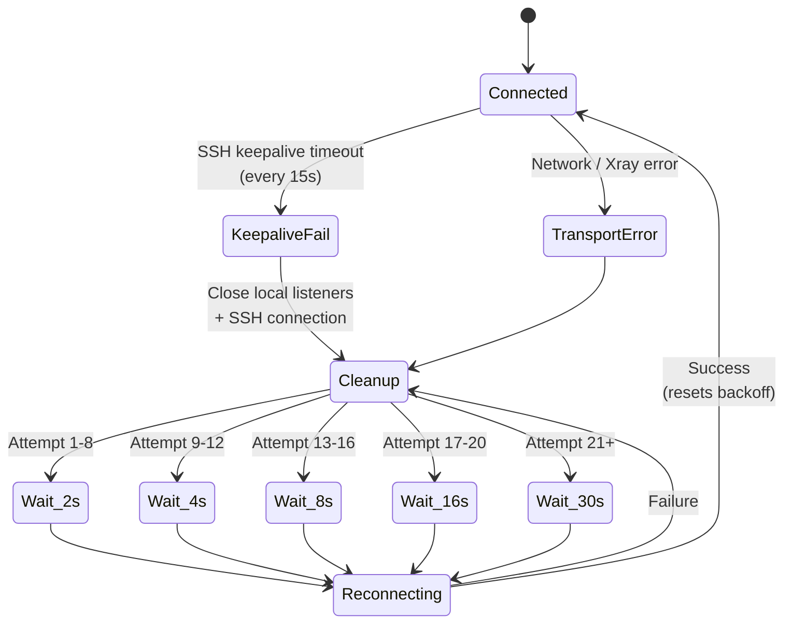
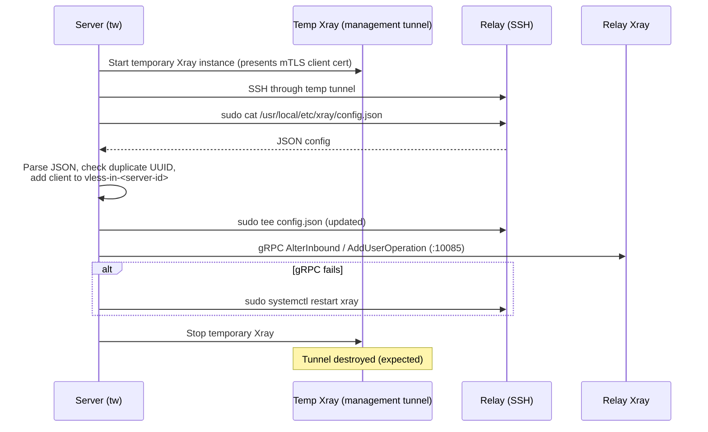
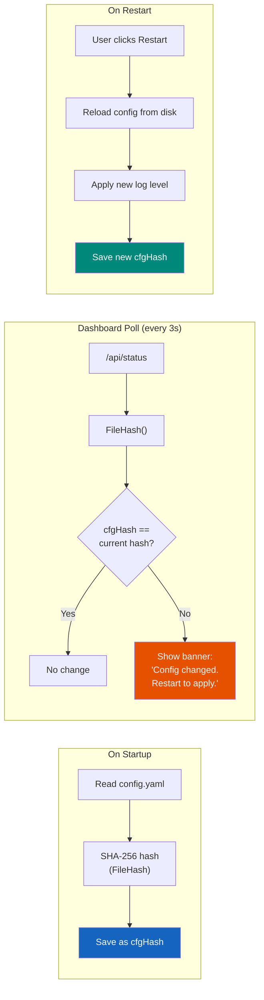
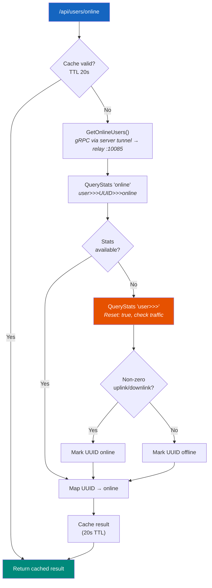
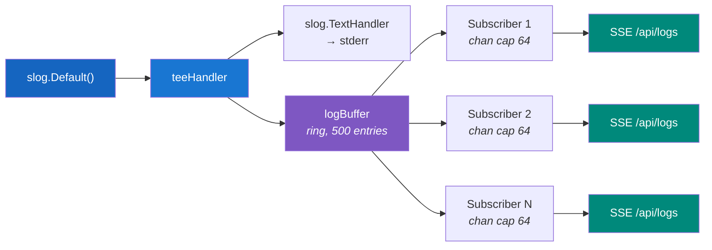
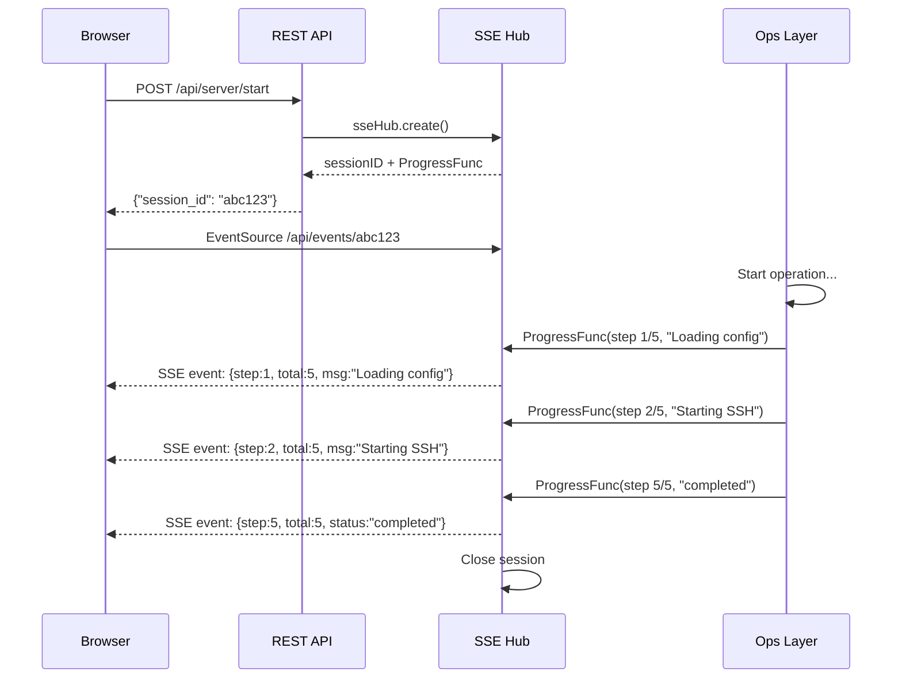
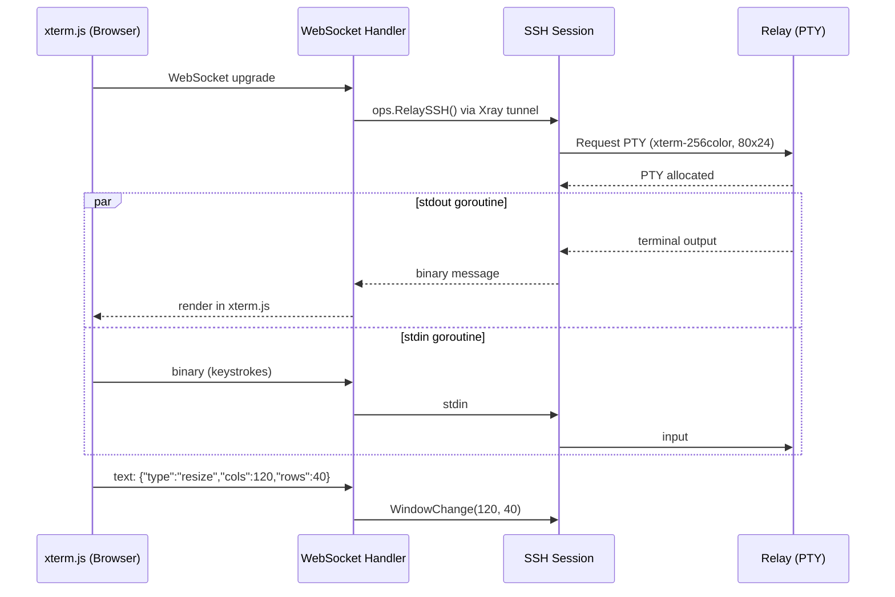

# Cross-cutting Concerns

## Auto-Reconnection


```mermaid
stateDiagram-v2
    [*] --> Connected
    Connected --> KeepaliveFail: SSH keepalive timeout<br/>(every 15s)
    Connected --> TransportError: Network / Xray error

    KeepaliveFail --> Cleanup: Close local listeners<br/>+ SSH connection
    TransportError --> Cleanup

    Cleanup --> Wait_2s: Attempt 1-8
    Cleanup --> Wait_4s: Attempt 9-12
    Cleanup --> Wait_8s: Attempt 13-16
    Cleanup --> Wait_16s: Attempt 17-20
    Cleanup --> Wait_30s: Attempt 21+

    Wait_2s --> Reconnecting
    Wait_4s --> Reconnecting
    Wait_8s --> Reconnecting
    Wait_16s --> Reconnecting
    Wait_30s --> Reconnecting

    Reconnecting --> Connected: Success<br/>(resets backoff)
    Reconnecting --> Cleanup: Failure
```

Both the forward tunnel (client) and reverse tunnel (server) implement exponential backoff reconnection:

- **Backoff:** 2s -> 4s -> 8s -> 16s -> 30s (max), staying roughly four attempts at each level; a drop *after* a successful connection resets the backoff so re-connection is fast
- **Keepalive:** SSH keepalive every 15 seconds; on failure, triggers reconnect
- **TCP Keepalive:** 30-second TCP keepalive on all connections
- **Forward tunnel cleanup:** On keepalive failure, all local listeners are closed first (unblocking Accept loops), then the SSH connection is closed, triggering the reconnect loop

---

## Dynamic User Management

The SSH server re-reads `authorized_keys` on every authentication attempt. This means:

- `tw server user create` takes effect immediately -- no need to restart the running server
- Revoking a user (removing their key from `authorized_keys`) takes effect on the next connection attempt
- Each key entry can have independent `permitopen` restrictions (and an optional `single-session` flag)

---

## Permitopen Enforcement

When the SSH server authenticates a client, it parses `permitopen` options from the matching `authorized_keys` entry and stores them in `gossh.Permissions.Extensions["permitopen"]`. On every `direct-tcpip` channel request, the server checks the target `host:port` against the permitted list. If no `permitopen` options are set (e.g., the server's own key), all destinations are allowed. A custom `single-session` option, enforced in `checkAuthorizedKey`, rejects a second concurrent connection for the same user.

---

## Relay Config Updates


```mermaid
sequenceDiagram
    participant S as Server (tw)
    participant TX as Temp Xray (management tunnel)
    participant R as Relay (SSH)
    participant XR as Relay Xray

    S ->> TX: Start temporary Xray instance (presents mTLS client cert)
    S ->> R: SSH through temp tunnel
    S ->> R: sudo cat /usr/local/etc/xray/config.json
    R -->> S: JSON config
    S ->> S: Parse JSON, check duplicate UUID,<br/>add client to vless-in-<server-id>
    S ->> R: sudo tee config.json (updated)
    S ->> XR: gRPC AlterInbound / AddUserOperation (:10085)
    alt gRPC fails
        S ->> R: sudo systemctl restart xray
    end
    S ->> TX: Stop temporary Xray
    Note over TX: Tunnel destroyed (expected)
```

`tw server user create` (and delete/unregister) updates the relay's Xray config remotely:

1. Starts a temporary Xray instance (dokodemo-door on `server.temp_xray_port+1`, default 59001, falling back to any free loopback port — separate from a running `tw server start`)
2. SSHs into the relay through the temporary tunnel using the server's SSH key
3. Reads `/usr/local/etc/xray/config.json` via `sudo cat`
4. Parses the JSON, checks for duplicate UUID, adds the new client entry to this server's own `vless-in-<server-id>` inbound
5. Writes the updated config via `sudo tee /usr/local/etc/xray/config.json` (persistence)
6. Hot-adds the UUID via the Xray gRPC API (`AlterInbound` / `AddUserOperation` on loopback `:10085`, forwarded over the SSH connection); falls back to `systemctl restart xray` if the API call fails

Relay-side *tenant* changes (server enroll / un-enroll) follow the same live-update philosophy but at a bigger granularity: the admin re-renders the Caddyfile, `authorized_keys`, and Xray `config.json` wholesale from the registry, then live-adds (`AddInbound` + `AddRule`) or live-removes the affected tenant via the same gRPC API — no Xray restart. Enroll and un-enroll are serialized by a local file lock (`internal/ops/oplock.go`).

---

## Transport Protocol

Xray VLESS + XHTTP over TLS:

- **VLESS:** Lightweight proxy protocol with UUID-based authentication
- **XHTTP:** HTTP-based transport that splits data into standard HTTP requests/responses (per-tenant path `/tw/<server-id>`, `stream-one` mode)
- **TLS:** Terminated by Caddy on the relay (mutual TLS — the client presents the per-server certificate); SNI matches the relay domain
- **Result:** Traffic is indistinguishable from normal HTTPS browsing to firewalls and DPI

---

## Config Change Detection


```mermaid
flowchart LR
    subgraph "On Startup"
        A[Read config.yaml] --> B["SHA-256 hash<br/>(FileHash)"]
        B --> C["Save as cfgHash"]
    end

    subgraph "Dashboard Poll (every 3s)"
        D["/api/status"] --> E["FileHash()"]
        E --> F{cfgHash ==<br/>current hash?}
        F -->|Yes| G["No change"]
        F -->|No| H["Show banner:<br/>'Config changed.<br/>Restart to apply.'"]
    end

    subgraph "On Restart"
        I[User clicks Restart] --> J[Reload config from disk]
        J --> K[Apply new log level]
        K --> L["Save new cfgHash"]
    end

    style C fill:#1565C0,color:#fff
    style H fill:#E65100,color:#fff
    style L fill:#00897B,color:#fff
```

`config.FileHash()` computes a SHA-256 digest of the raw config file on disk. Unlike `Config.Hash()` (which marshals the parsed struct), `FileHash()` captures all changes including unknown fields, comments, and formatting differences.

On server or client start, the current file hash is saved as `cfgHash` in the respective manager struct. The `ConfigChanged()` method on `Ops` compares the current file hash against the startup hash:

```go
func (o *Ops) ConfigChanged() bool {
    currentHash := config.FileHash()
    // Compare against server's cfgHash if running...
    // Compare against client's cfgHash if running...
}
```

The dashboard polls `ConfigChanged()` every 3 seconds via the `/api/status` endpoint. When a change is detected, the UI shows a banner:

> "Configuration has changed. Restart/Reconnect to apply."

!!! note "Changes take effect on restart"
    Config changes are never applied live to a running server or client. The user must explicitly restart (server) or reconnect (client) to pick up the new configuration. On restart, the config is reloaded from disk and the new log level is applied via `logging.SetLevel()`.

---

## Mode Enforcement

The `mode` field in `config.yaml` can be `"relay"`, `"server"`, `"client"`, or empty (bootstrap). The legacy value `"admin"` is canonicalized to `"relay"` on read. When set:

- **CLI**: `requireMode(allowed ...string)` in `root.go` checks the configured mode before executing a command. Relay-only commands (e.g., `tw relay create`, `tw relay enroll-server`) return an error in server or client mode, and so on for each role; the variadic form lets a command be allowed in more than one mode.
- **Dashboard**: The `pageData.Mode` field is passed to all templates. Navigation links and page content adapt -- pages belonging to other roles are hidden.

```go
// modeError is the pure decision behind requireMode:
// nil if current is unset or present in allowed, otherwise a descriptive error.
func modeError(current string, allowed []string) error {
    if current == "" {
        return nil // mode not set yet, allow
    }
    for _, a := range allowed {
        if current == a {
            return nil
        }
    }
    return fmt.Errorf("this command requires %s mode, but tw is configured in %s mode",
        strings.Join(allowed, " or "), current)
}
```

**Mode signature (tamper-evidence).** The mode is additionally protected by a detached ed25519 signature (`mode_auth: {sig, issuer}` in config, `internal/ops/modeauth`) over `(mode, profile identity)`, where the identity is the profile's own `id_ed25519.pub`. The relay signs its own mode with its own key; a server's mode is signed by the relay admin in the join-response; a client's mode is signed by its server in the exported user bundle. `requireMode` verifies the signature on every gated command: a present-but-invalid signature (a hand-edited `mode` field) is refused with a re-enroll/re-import hint; a missing signature is legacy-tolerated with a warning (the relay self-heals by re-signing). This is deliberately *not* a security boundary — the real role boundary is the relay's `authorized_keys` restrictions and the mTLS/PKI trust chain.

---

## User Online Tracking


```mermaid
flowchart TD
    REQ["/api/users/online"] --> CACHE{Cache valid?<br/>TTL 20s}
    CACHE -->|Yes| RET[Return cached result]
    CACHE -->|No| QUERY["GetOnlineUsers()<br/><i>gRPC via server tunnel → relay :10085</i>"]

    QUERY --> PRIMARY["QueryStats 'online'<br/><i>user>>>UUID>>>online</i>"]
    PRIMARY --> HAS{Stats<br/>available?}
    HAS -->|Yes| MAP[Map UUID → online]
    HAS -->|No| FALLBACK["QueryStats 'user>>>'<br/><i>Reset: true, check traffic</i>"]
    FALLBACK --> TRAFFIC{Non-zero<br/>uplink/downlink?}
    TRAFFIC -->|Yes| ONLINE[Mark UUID online]
    TRAFFIC -->|No| OFFLINE[Mark UUID offline]
    ONLINE --> MAP
    OFFLINE --> MAP
    MAP --> SAVE["Cache result<br/>(20s TTL)"]
    SAVE --> RET

    style REQ fill:#1565C0,color:#fff
    style RET fill:#00897B,color:#fff
    style FALLBACK fill:#E65100,color:#fff
```

The server tracks which client users are currently connected by polling the relay's Xray Stats API:

1. **Stats query**: `GetOnlineUsers()` connects to the relay's Xray gRPC API (port `10085`) via the server's already-running Xray tunnel (using `sshThroughServerTunnel()`, which avoids creating a temporary Xray instance).
2. **Primary method**: Queries `QueryStats` with pattern `"online"` looking for `user>>>{UUID}>>>online` stats entries (Xray `statsUserOnline` feature).
3. **Fallback**: If no online stats are available, falls back to traffic-based detection: queries `user>>>` pattern with `Reset_: true`, and any UUID with non-zero `traffic>>>uplink` or `traffic>>>downlink` since the last poll is considered online. The server's own UUID is excluded.
4. **Caching**: Results are cached with a 20-second TTL (`onlinePoll` timestamp). Concurrent refresh attempts return the stale cache instead of blocking.
5. **Relay setup**: freshly provisioned relays already carry `stats`, `StatsService`, and the stats `policy` in the rendered Xray config (`relayconfig.json.tmpl`). `EnsureRelayStats()` still runs in the background at server startup to patch legacy relays that predate the template; if patching occurs, Xray is restarted on the relay.

The dashboard's users page calls `/api/users/online` which returns the online map. Online users are shown with a badge in the UI.

!!! warning "Relay compatibility"
    The `statsUserOnline` feature requires Xray v26.2.6+; the relay's pinned Xray (`v26.6.27`) includes it. Older hand-managed relays fall back to traffic-based detection, which has lower granularity (a user appears online only while actively transferring data).

---

## Dashboard Architecture

The dashboard is a server-rendered web application using Go templates and vanilla JavaScript. All assets (templates, CSS, JS, xterm.js vendor files) are embedded in the binary via `go:embed`.

### Log Streaming

The `teeHandler` wraps the existing `slog.Handler` to duplicate every log record into a `logBuffer` ring buffer (capacity: 500 entries). This architecture preserves the original handler chain -- including the dynamic `slog.LevelVar` for runtime log level changes -- while feeding the dashboard.


```mermaid
flowchart LR
    SLOG["slog.Default()"] --> TEE["teeHandler"]
    TEE --> INNER["slog.TextHandler<br/>→ stderr"]
    TEE --> BUF["logBuffer<br/><i>ring, 500 entries</i>"]
    BUF --> S1["Subscriber 1<br/><i>chan cap 64</i>"]
    BUF --> S2["Subscriber 2<br/><i>chan cap 64</i>"]
    BUF --> SN["Subscriber N<br/><i>chan cap 64</i>"]
    S1 --> SSE1["SSE /api/logs"]
    S2 --> SSE2["SSE /api/logs"]
    SN --> SSEN["SSE /api/logs"]

    style SLOG fill:#1565C0,color:#fff
    style TEE fill:#1976D2,color:#fff
    style BUF fill:#7E57C2,color:#fff
    style SSE1 fill:#00897B,color:#fff
    style SSE2 fill:#00897B,color:#fff
    style SSEN fill:#00897B,color:#fff
```

Each SSE subscriber gets a buffered channel (capacity 64). Slow subscribers have events dropped rather than blocking the log pipeline.

### Progress Events (SSE)

Long-running operations (relay provisioning, server start, user creation) report progress via `ProgressFunc` callbacks. The SSE hub (`sseHub`) manages sessions:


```mermaid
sequenceDiagram
    participant B as Browser
    participant API as REST API
    participant HUB as SSE Hub
    participant OPS as Ops Layer

    B ->> API: POST /api/server/start
    API ->> HUB: sseHub.create()
    HUB -->> API: sessionID + ProgressFunc
    API -->> B: {"session_id": "abc123"}
    B ->> HUB: EventSource /api/events/abc123

    OPS ->> OPS: Start operation...
    OPS ->> HUB: ProgressFunc(step 1/5, "Loading config")
    HUB -->> B: SSE event: {step:1, total:5, msg:"Loading config"}
    OPS ->> HUB: ProgressFunc(step 2/5, "Starting SSH")
    HUB -->> B: SSE event: {step:2, total:5, msg:"Starting SSH"}
    OPS ->> HUB: ProgressFunc(step 5/5, "completed")
    HUB -->> B: SSE event: {step:5, total:5, status:"completed"}
    HUB ->> HUB: Close session
```

1. Dashboard initiates an operation via a REST API call (e.g., `POST /api/server/start`)
2. The handler creates an SSE session with `sseHub.create()`, which returns a session ID and a `ProgressFunc`
3. The session ID is returned to the browser in the JSON response
4. The browser opens an `EventSource` connection to `/api/events/{sessionID}`
5. Progress events flow: `ops` method -> `ProgressFunc` -> `sseSession.ch` -> SSE stream -> browser
6. Terminal events (`status: "completed"` with `step == total`, or `status: "failed"`) close the session

### WebSocket SSH Terminal


```mermaid
sequenceDiagram
    participant XT as xterm.js (Browser)
    participant WS as WebSocket Handler
    participant SSH as SSH Session
    participant R as Relay (PTY)

    XT ->> WS: WebSocket upgrade
    WS ->> SSH: ops.RelaySSH() via Xray tunnel
    SSH ->> R: Request PTY (xterm-256color, 80x24)
    R -->> SSH: PTY allocated

    par stdout goroutine
        R -->> SSH: terminal output
        SSH -->> WS: binary message
        WS -->> XT: render in xterm.js
    and stdin goroutine
        XT ->> WS: binary (keystrokes)
        WS ->> SSH: stdin
        SSH ->> R: input
    end

    XT ->> WS: text: {"type":"resize","cols":120,"rows":40}
    WS ->> SSH: WindowChange(120, 40)
```

The `/api/relay/ssh` endpoint provides a browser-based SSH terminal to the relay:

1. Browser opens a WebSocket connection
2. Server upgrades the connection and establishes an SSH session to the relay via the Xray tunnel (`ops.RelaySSH()`)
3. A PTY is requested (`xterm-256color`, 80x24)
4. Two goroutines bridge the streams:
    - **SSH stdout -> WebSocket**: binary messages carry terminal output
    - **WebSocket -> SSH stdin**: binary messages carry keyboard input; text messages carry JSON control frames (`{"type":"resize","cols":120,"rows":40"}`)
5. The browser renders the terminal using xterm.js with the fit addon for automatic resizing

---

## Build-time Version Injection

The application version is stored in a single package-level variable:

```go
// internal/version/version.go
var Version = "dev"
```

This variable is overridden at build time via Go's `-ldflags -X` mechanism. The Makefile auto-detects the version from `git describe --tags --always --dirty`, while the GitHub Actions release workflow injects the exact tag name (e.g. `v1.2.3`).

The version is consumed in two places:

- **CLI**: Cobra's `Version` field on the root command, enabling `tw --version`
- **Dashboard API**: The `/api/status` endpoint includes the `version` field in its JSON response

---

## Xray Version Pinning

The Xray version installed on the relay is controlled by a single constant:

```go
// internal/relay/terraform/generate.go
XrayVersion = "v26.6.27" // must stay compatible with the xray-core in go.mod (pinned mtls commit)
```

This constant is injected into both:

- **cloud-init.yaml.tmpl**: used during `tw relay create` to provision new cloud relays
- **install-script.sh.tmpl**: used for manual (bring-your-own VM) relay setup

Both templates pass `--version {{ .XrayVersion }}` to the official Xray install script. The relay's standalone Xray release must stay protocol-compatible with the in-process `xray-core` dependency in `go.mod` (currently a pinned upstream mtls-branch commit rather than a tagged release), preventing VLESS/XHTTP incompatibilities.

!!! warning "Version sync"
    When bumping `github.com/xtls/xray-core` in `go.mod`, check whether the `XrayVersion` constant in `generate.go` needs to move too. Existing relays will continue running the old version until reprovisioned or manually updated.

---

## Certificate Lifecycle (mutual-TLS admission)

The relay admits connections via mutual TLS, backed by a per-server certificate
authority. The lifecycle is handled transparently:

- **Generation** — on the first `tw server start` (or `tw server join-relay` /
  `tw relay create`), `internal/ops/keys.go` (`ensureCerts`) creates the CA
  (`ca.crt`/`ca.key`) and issues the server's client certificate
  (`client.crt`/`client.key`, CN = server-id) via `internal/pki`. Generation is
  **idempotent and self-healing**: an existing CA is never regenerated, but a
  missing client cert is re-issued from the existing CA. It is skipped in client
  mode.
- **Distribution to the relay** — for the admin's own entry, the CA *public*
  certificate is base64-embedded into cloud-init / the install script and written
  to `/etc/caddy/ca/<server-id>.crt` at provisioning; for joined servers, the
  admin writes their CA cert (carried in the join-request) to the same location
  during enrollment and reloads Caddy. The rendered Caddyfile
  (`client_auth require_and_verify` with one trust-pool entry per tenant) is
  rewritten the same way. CA signing keys never leave their servers — the relay
  only ever holds public certificates.
- **Distribution to clients** — `client.crt`/`client.key` are included in every
  exported user context bundle (`tw config export-user`). The same per-server
  certificate is shared by all of that server's users; `applyClientCertPaths`
  derives the on-disk paths at runtime so a bundle works regardless of platform
  or `TW_CONFIG_DIR`.
- **Rotation** — re-provisioning the relay (or un-enrolling and re-enrolling a
  server) regenerates that tenant's trust-pool entry. There is no per-user
  certificate and no CRL on the relay; per-user revocation is an SSH
  `authorized_keys` operation (see [Access Control](../security/access-control.md)),
  and per-server revocation is `tw relay un-enroll-server`.

Validity: CA 10 years, client certificate 5 years (ECDSA P-256). Full detail on
[Relay Authentication](../security/relay-authentication.md).

!!! note "Xray-core mutual-TLS dependency"
    Presenting a client certificate on an *outbound* TLS connection is a recent
    Xray-core capability (older releases wired only server-side certificate
    selection, and the uTLS path used by XHTTP dropped the certificate fields).
    `go.mod` therefore pins `github.com/xtls/xray-core` to the upstream commit
    that introduced native mTLS — the `usage: "client-cert"` certificate type
    with the `GetClientCertificate` callback carried through to the uTLS path.
    This requires **Go 1.26**; the build is a plain `go build` with no fork or
    patch. When upstream publishes mTLS in a tagged release, bump the version.

---

## Key Dependencies

| Dependency | Version | Purpose |
| ---------- | ------- | ------- |
| `github.com/xtls/xray-core` | pinned upstream mtls commit (`v1.260327.1-0.20260617150841-…`) | In-process VLESS + XHTTP + mTLS transport |
| `golang.org/x/crypto` | v0.51.0 | Embedded SSH server + client tunnels |
| `github.com/spf13/cobra` | v1.8.1 | CLI framework |
| `github.com/google/uuid` | v1.6.0 | UUID generation for Xray clients |
| `github.com/gorilla/websocket` | v1.5.3 | WebSocket for dashboard SSH terminal |
| `google.golang.org/grpc` | v1.81.1 | gRPC API server + relay live-add/stats queries |
| `gopkg.in/yaml.v3` | v3.0.1 | Configuration file handling |
