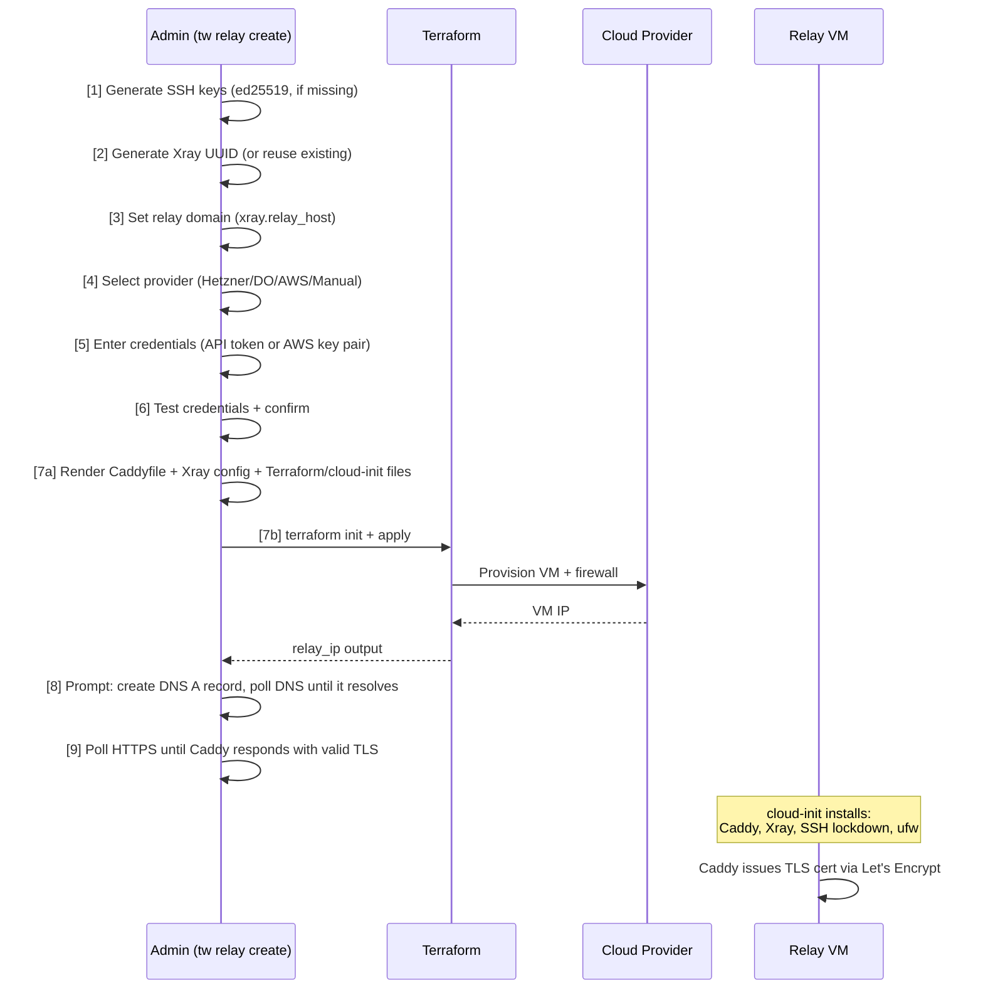
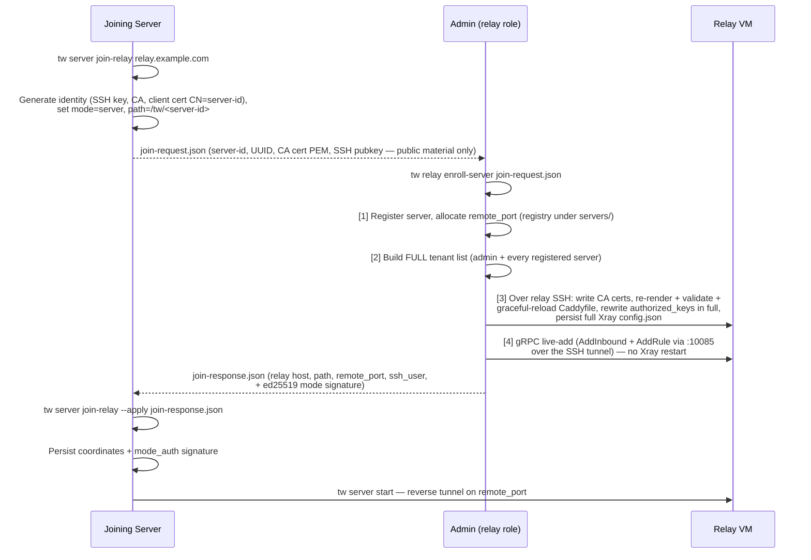
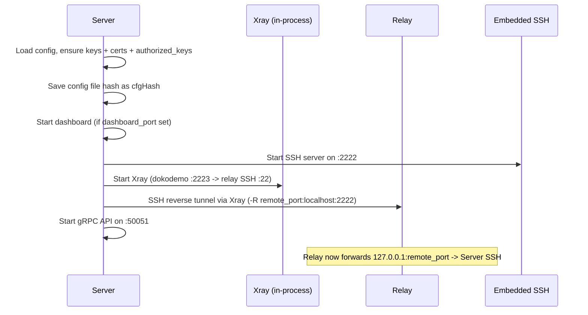
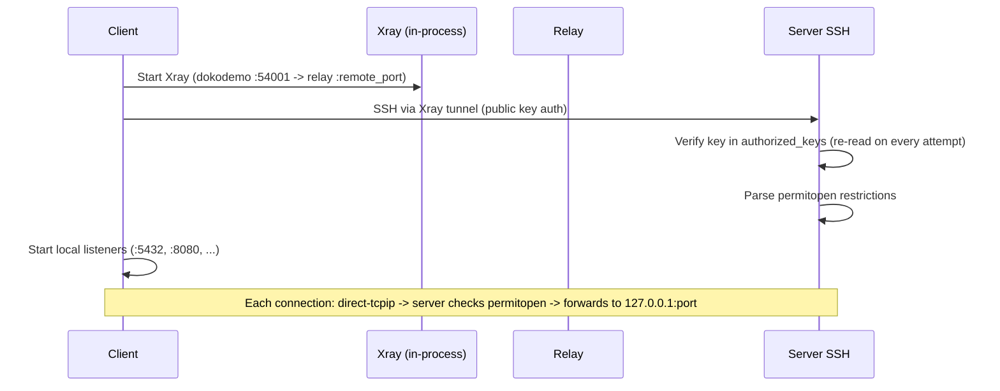
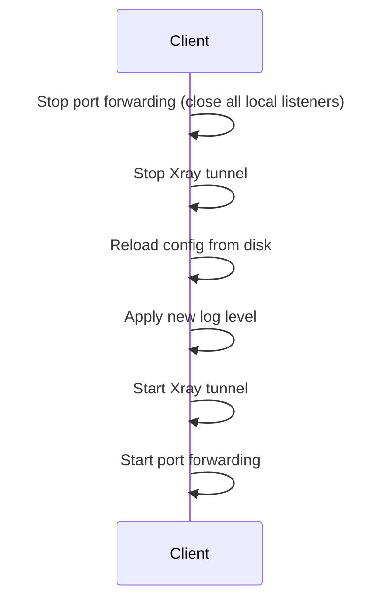

# Runtime Views

## Relay Provisioning (`tw relay create`)

Interactive 9-step wizard, run on the admin machine (mode `relay`). Providers: Hetzner, DigitalOcean, AWS (via Terraform, which must be in PATH), or **Manual** — a bring-your-own VM set up with a tw-generated install script. `--provider manual --domain <d> --ip <ip>` runs fully non-interactive; `--ssh-open` optionally leaves port 22 open to the internet.



**Pre-check:** If a relay already exists (terraform.tfstate or manual-relay marker present), the wizard offers to destroy and recreate (non-interactive runs fail instead). For AWS, destruction requires re-entering credentials (passed via env vars). For Hetzner/DO, credentials are read from the existing `terraform.tfvars`.

**Credential testing:** Hetzner and DigitalOcean tokens are tested with a live API call (GET to their servers/account endpoint with Bearer auth). AWS credentials are format-checked (key ID length >= 16, secret length >= 30); full validation happens during `terraform apply`.

**File generation:** The wizard calls `terraform.Generate()` which renders:

- `cloud-init.yaml` -- from `cloud-init.yaml.tmpl` with baked values (domain, SSH user, public key, pinned Xray version, `--ssh-open` conditionals) plus the base64-embedded Caddyfile, relay Xray `config.json`, and CA certificate rendered by `internal/relay/{caddy,xray}`
- `main.tf` -- the selected provider's template (rendered for the `--ssh-open` firewall conditional)

For a **manual** relay, `GenerateManualInstallScript()` renders the same material into a self-contained shell script (`install-script.sh.tmpl`) the operator runs as root on their own Ubuntu VM; the script is idempotent and re-runnable.

Credentials are stored as:

- Hetzner/DO: `terraform.tfvars` in the relay directory (e.g. `hcloud_token = "..."`)
- AWS: passed via `AWS_ACCESS_KEY_ID` and `AWS_SECRET_ACCESS_KEY` environment variables to `terraform` commands

The cloud-init / install script on the relay:

1. Creates the SSH user with the admin's public key (pinned `from="127.0.0.1"` unless `--ssh-open`) and passwordless sudo
2. Installs Caddy from the official apt repo, Xray via the official install script pinned to `terraform.XrayVersion`
3. Writes the rendered Xray config (`api-in` on `127.0.0.1:10085`; the admin's own `vless-in-<id>` inbound on `127.0.0.1:<remote-port>+10000` with XHTTP; freedom outbound restricted to loopback via `finalRules`; per-tenant allow/deny routing rules)
4. Writes the admin's CA public certificate to `/etc/caddy/ca/<server-id>.crt` (base64 in cloud-init)
5. Writes the rendered Caddyfile — the mutual-TLS gate (`client_auth require_and_verify` against the CA trust pool, TLS 1.3 only) plus a per-tenant `handle` matching `/tw/<server-id>*` and cert `CN=<server-id>`, proxying h2c to the tenant's VLESS inbound
6. Locks down SSH to `127.0.0.1` only (`0.0.0.0` with `--ssh-open`), disables password authentication
7. Configures firewall: deny all incoming, allow 80/tcp + 443/tcp (+ 22/tcp with `--ssh-open`)

The Caddyfile, Xray config, and CA certificate are **rendered by tw** at provisioning
time (`internal/relay/{caddy,xray}` → `internal/ops/relay.go`) and embedded as base64,
so the relay boots with the mTLS gate already in place. See
[Relay Authentication](../security/relay-authentication.md).

---

## Server Enrollment (`tw server join-relay` / `tw relay enroll-server`)

A second (or Nth) server joins an existing relay without touching the relay VM directly — the admin mediates via two small JSON artifacts:



Key properties:

- **Non-disruptive** — existing tenants' tunnels stay up: Caddy reloads gracefully, and the new Xray inbound + routing rules are added live over the gRPC API; the full `config.json` is written only for restart persistence.
- **Full-rewrite philosophy** — the Caddyfile, relay `authorized_keys`, and relay Xray config are re-rendered from the complete registry on every enroll/un-enroll, so stale or corrupted state self-heals.
- **Serialized** — enroll and un-enroll take a local file lock (`internal/ops/oplock.go`), so concurrent admin operations cannot interleave.
- **Tenant confinement** — each server's `authorized_keys` line is `from="127.0.0.1",restrict,port-forwarding,permitopen=<dead sentinel>,permitlisten=<own remote_port>`: it can publish exactly its own reverse port and nothing else (no shell, no reaching the relay's gRPC API).
- **Un-enroll** (`tw relay un-enroll-server <id>`) reverses everything *and* severs live state: rewrites `authorized_keys` first (blocks re-auth), removes the tenant's routing rules and inbound via gRPC, kills the sshd session holding its reverse listener, removes its Caddy handle and CA cert, then forgets the registry entry.

---

## User Creation (`tw server user create`)

Interactive wizard, four progress steps:

```mermaid
sequenceDiagram
    participant Admin as Server operator (tw)
    participant R as Relay (via management tunnel)
    participant AK as authorized_keys

    Admin ->> Admin: Enter username + port mappings<br/>(client local port -> server port, localhost only)
    Admin ->> Admin: [1] Generate UUID + ed25519 SSH key pair
    Admin ->> R: [2] Hot-add UUID to this server's own<br/>vless-in-&lt;server-id&gt; inbound on the relay
    Admin ->> Admin: [3] Write client config + keys to users/<name>/
    Admin ->> AK: [4] Append public key with permitopen restrictions
```

**Port mapping flow:** Ports are entered one mapping at a time in sequence. For each mapping, the wizard asks for the client's local port and the server port. The remote host is locked to `127.0.0.1` -- clients cannot forward to the server's wider network.

**Relay update mechanism** (`addUUIDToRelay` via `withRelaySSH`):

1. Starts a temporary management Xray instance (dokodemo-door on `server.temp_xray_port+1`, default 59001, falling back to any free loopback port) so it never conflicts with a running `tw server start`
2. SSHs into the relay through the temporary tunnel using the server's private key (the tunnel presents the server's mTLS client cert)
3. Reads `/usr/local/etc/xray/config.json` via `sudo cat`
4. Parses the JSON, adds the new UUID to the clients of this server's own `vless-in-<server-id>` inbound
5. Writes the updated config via `sudo tee` (persistence across Xray restarts)
6. Hot-adds the UUID via the Xray gRPC API (`AlterInbound` / `AddUserOperation` on `:10085`); falls back to `systemctl restart xray` if the API call fails

**Generated files** in `<config_dir>/users/<name>/`:

- `config.yaml` -- client config with Xray settings (client UUID, relay host/port, the server's `/tw/<server-id>` path) and tunnel mappings
- `id_ed25519` -- client SSH private key
- `id_ed25519.pub` -- client SSH public key

The generated `authorized_keys` entry:

```text
permitopen="127.0.0.1:5432",permitopen="127.0.0.1:8080" ssh-ed25519 AAAA... alice@tw
```

This restricts the client to forwarding only to the specified `127.0.0.1` ports on the server. An optional `single-session` option (toggled per user) limits the user to one concurrent SSH session.

**Delivery:** `tw config export-user <name>` seals the user's config, SSH keys, and the per-server `client.crt`/`client.key` into a portable context bundle. The user's `config.yaml` is stamped `mode: client` and carries a `mode_auth` signature issued by the server. The client imports it with `tw config import` and connects.

---

## Server Startup (`tw server start`)



**Key generation:** On first run, `ensureKeys` generates an ed25519 SSH key pair (`id_ed25519` / `id_ed25519.pub`), an SSH host key (`ssh_host_ed25519_key`), seeds `authorized_keys` with the server's own public key, and (`ensureCerts`) creates the per-server CA and client certificate.

**Xray configuration:** The server-side Xray creates a dokodemo-door inbound on `sshPort+1` (default 2223, overridable via `server.xray_port`) that forwards to the relay's SSH port (default 22) via the VLESS+XHTTP+mTLS outbound on the server's `/tw/<server-id>` path.

**UUID auto-generation:** If `xray.uuid` is empty when the server starts with `relay_host` configured, a UUID is generated and saved to config automatically.

---

## Client Connection (`tw client connect`)



**Multi-mapping over single session:** The client opens a single SSH session and creates multiple local listeners -- one per tunnel mapping. All port forwards share the same SSH connection. Listeners bind `client.listen_address` (default `127.0.0.1`; set `0.0.0.0` to expose tunnels, e.g. in containers).

**Client-side Xray:** The dokodemo-door inbound listens on `client.xray_port` (default 54001) and forwards to the server's remote SSH port on the relay (`client.server_ssh_port`, set from the server's admin-assigned `remote_port`).

---

## Client Reconnect

When the client detects a connection failure (SSH keepalive timeout or transport error), it performs a full teardown and rebuild:



!!! note "Backoff"
    Reconnection uses stepped exponential backoff: 2s, 4s, 8s, 16s, up to a maximum of 30s between attempts (staying several attempts at each level). See [Cross-cutting Concerns](cross-cutting.md#auto-reconnection) for details.

---

## Data Flow (End-to-End)

```text
Client app                                                              Server service
    |                                                                         ^
    v                                                                         |
localhost:5432 --> SSH channel (direct-tcpip) ------------------> 127.0.0.1:5432
    |                        |                                        ^
    v                        v                                        |
Xray dokodemo    VLESS+XHTTP+mTLS :443       Xray freedom       SSH reverse tunnel
(:54001)         path /tw/<server-id>     (loopback only) --> (127.0.0.1:<remote_port>
                      Relay                     ^                on relay)
                  Caddy :443 ---------> vless-in-<server-id>          |
                  (mTLS gate,          (127.0.0.1:                    |
                   per-tenant handle)   <remote_port>+10000)   Server SSH :2222
```
