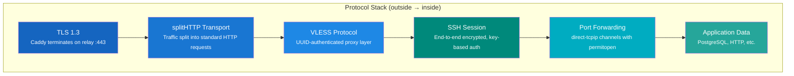
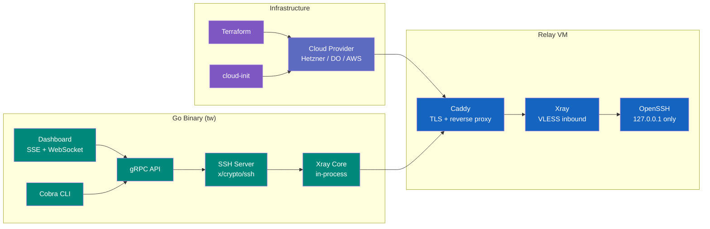

# Solution Strategy

## Protocol Stack

The system layers multiple protocols to achieve secure, firewall-transparent tunneling:

## Technology Integration

## Challenge-Solution Map

| Challenge | Solution | Technology |
| --------- | -------- | ---------- |
| Firewalls block non-HTTPS traffic | Encapsulate all traffic in TLS on port 443 | Xray (VLESS + splitHTTP) |
| Server and client are behind NAT | All connections are outbound-only; relay is the rendezvous point | SSH reverse port forwarding |
| Relay must never see plaintext | End-to-end encryption between client and server | SSH session layer |
| TLS certificates for the relay | Automatic issuance and renewal | Caddy (ACME / Let's Encrypt) |
| Per-user access control | Public key auth with port restrictions | SSH `authorized_keys` + `permitopen` |
| Infrastructure provisioning | Interactive wizard generates Terraform + cloud-init | Terraform (Hetzner, DigitalOcean, AWS) |
| Cross-platform operation | Single binary for both server and client | Go (Linux + Windows) |
| Dynamic user management | Re-read authorized_keys on every auth attempt | No server restart needed |
| Config change detection | SHA-256 hash comparison of config file | `crypto/sha256` |
| Real-time dashboard | SSE for progress + log streaming, WebSocket for SSH terminal | Go `net/http`, `gorilla/websocket`, xterm.js |
| Runtime log level | Dynamic `slog.LevelVar` propagates through handler chain | `log/slog` |
