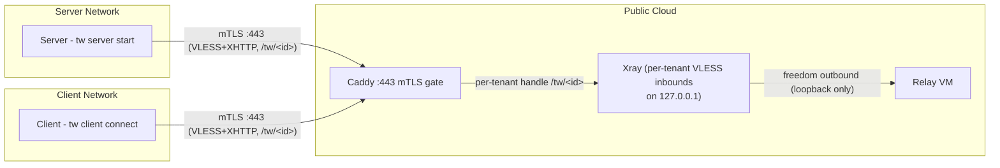

# System Context

## Introduction and Goals

Tunnel Whisperer creates resilient, application-layer bridges for specific ports across separated private networks. It encapsulates traffic in standard HTTPS to traverse strict firewalls, NAT, and DPI-controlled environments.

### Requirements Overview

The system connects **servers** behind private networks to **clients** behind other private networks, via a publicly reachable **relay**. All connectivity is egress-only from both sides. The relay is provisioned and owned by an admin machine running in the **relay** role (`tw relay create` — an interactive CLI wizard, cloud/Terraform or manual install script). The relay is multi-tenant: additional servers join it through a join-request/join-response enrollment handshake (`tw server join-relay` / `tw relay enroll-server`), each tenant isolated behind its own URL path, CA, and loopback port. Every installation's role (`relay`, `server`, or `client`) is recorded in config and ed25519-signed as tamper-evidence (`internal/ops/modeauth`).

### Quality Goals

| Priority | Goal | Description |
| -------- | ---- | ----------- |
| 1 | Firewall traversal | Only port 443 (HTTPS) is exposed; compatible with strict corporate firewalls and DPI |
| 2 | Zero inbound ports | Neither client nor server requires any inbound connectivity |
| 3 | Transport resilience | Xray provides robust tunneling over TLS/XHTTP, surviving network disruptions |
| 4 | Session security | SSH handles authentication, encryption, and port-level access control |
| 5 | Per-user lockdown | Each client is restricted to specific localhost ports via `permitopen` |
| 6 | Tenant isolation | Each enrolled server gets its own Caddy handle (path + client-cert CN match), its own CA in the trust pool, its own loopback VLESS inbound, and allow/deny routing rules confining it to its two loopback ports |

---

## System Scope and Context

### Business Context

### Technical Context

| Protocol | Port | Direction | Purpose |
| -------- | ---- | --------- | ------- |
| mTLS (Xray VLESS+XHTTP) | 443 | Server -> Relay | Transport tunnel for SSH reverse forwarding; presents X.509 client cert (CN = server-id) on path `/tw/<server-id>` |
| mTLS (Xray VLESS+XHTTP) | 443 | Client -> Relay | Transport tunnel for SSH local forwarding; presents the same per-server client cert |
| HTTPS + mTLS (Caddy) | 443 | External -> Relay | TLS 1.3 termination with `client_auth require_and_verify` against a per-tenant CA trust pool (admission gate), per-tenant `handle` blocks proxying to that tenant's loopback VLESS inbound |
| HTTP | 80 | External -> Relay | ACME challenge for Let's Encrypt certificate issuance |
| SSH (over Xray) | -- | End-to-end | Reverse/local port forwarding and session security |
| SSH (embedded) | 2222 | Local | Server's embedded SSH server (Go `x/crypto/ssh`) |
| VLESS inbound | `<remote-port>+10000` | Relay-local | One `vless-in-<server-id>` inbound per tenant on `127.0.0.1`, fed by that tenant's Caddy handle |
| gRPC | 50051 | Local | Server API for dashboard and tooling |
| gRPC | 10085 | Relay-local | Xray API (`HandlerService`, `StatsService`, `RoutingService`) — live tenant/user add-remove and online tracking, reached over an SSH tunnel |

!!! warning "Not exposed on the relay"
    By default SSH port 22 is bound to `127.0.0.1` only and reachable exclusively through the Xray tunnel; the relay firewall allows only ports 80 and 443. Provisioning with `--ssh-open` additionally opens port 22 for direct human access — tw's own key stays usable, and tenant keys remain pinned to loopback (`from="127.0.0.1"`) regardless.
