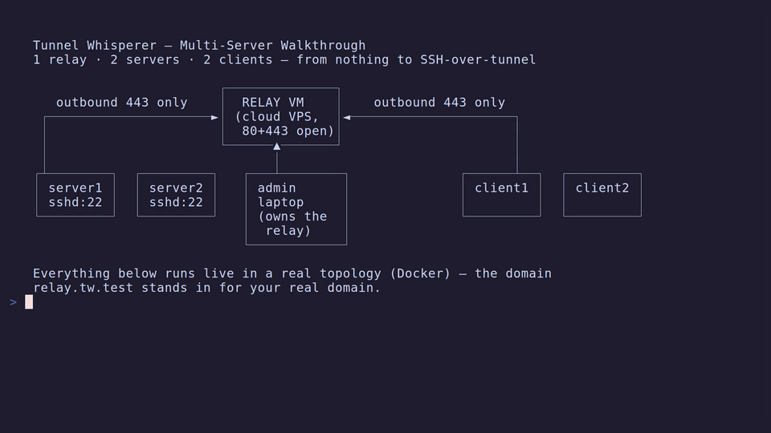
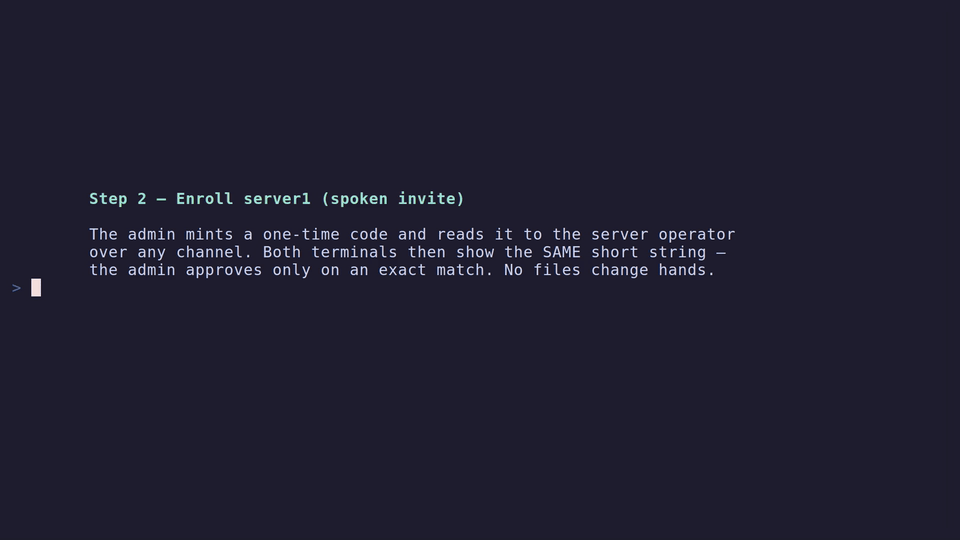
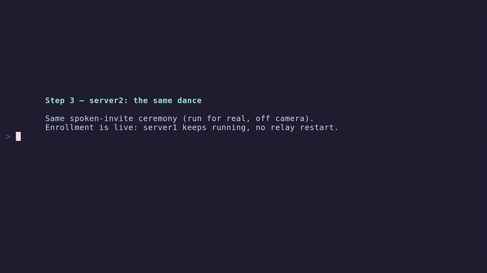
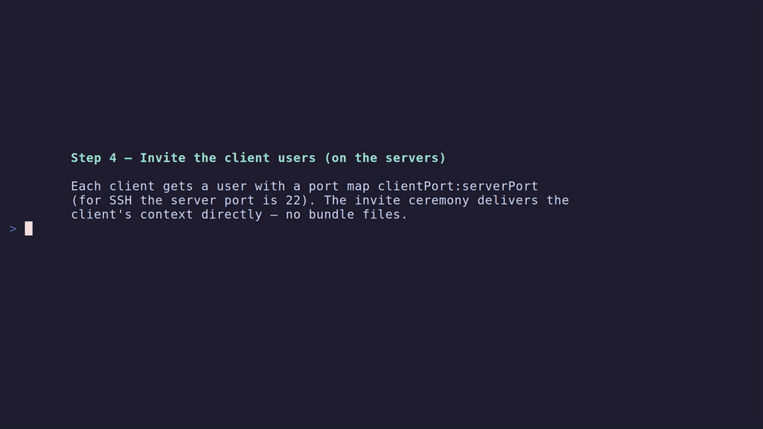
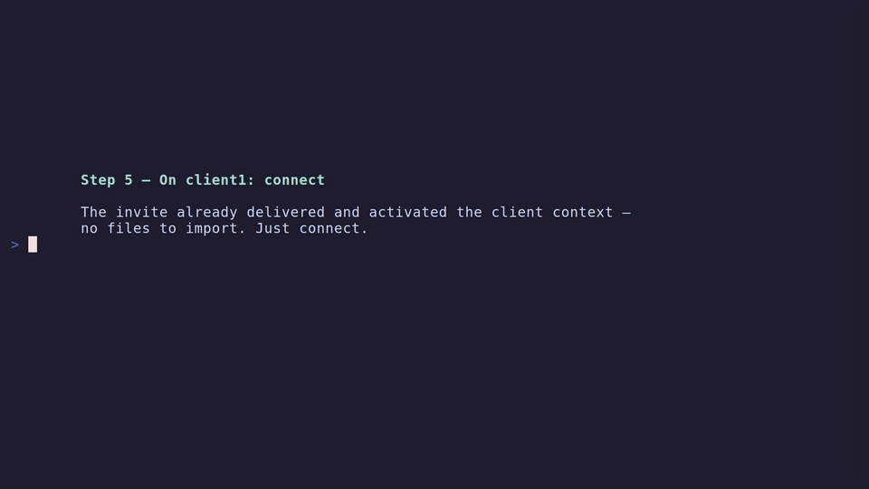

# Multi-Server Walkthrough: 1 Relay, 2 Servers, 2 Clients

A complete from-scratch setup: one relay, two servers enrolled on it, and two clients each reaching a server's SSH through the tunnel.

Each step below embeds its segment of a live recording made against a real topology (silent).

## Topology

```
                        ┌──────────────┐
   outbound 443 only    │  RELAY VM    │    outbound 443 only
 ┌─────────────────────►│ (cloud VPS,  │◄─────────────────────┐
 │                      │  80+443 open)│                      │
 │                      └──────▲───────┘                      │
 │                             │                              │
┌┴────────┐  ┌─────────┐   ┌───┴────────┐              ┌──────┴──┐  ┌─────────┐
│ server1 │  │ server2 │   │ admin      │              │ client1 │  │ client2 │
│ sshd:22 │  │ sshd:22 │   │ laptop     │              │         │  │         │
└─────────┘  └─────────┘   │ (owns the  │              └─────────┘  └─────────┘
                           │  relay)    │
                           └────────────┘
```

Five machines run `tw`: your admin laptop, server1, server2, client1, client2. The relay VM itself only runs Caddy + Xray (installed by the generated script). Nobody needs an inbound port except the relay (80/443); everyone else connects outbound over HTTPS.

!!! warning "One role per profile — run each step on the right box"
    The first role command a machine runs sets its active profile to that role (`relay`, `server`, or `client`); from then on, commands of the other two roles refuse to run in it. This locks the *profile*, not the machine — you can always hold another role in a separate [context](../global/contexts.md) — but for this walkthrough, keep it simple: one role per machine.

## Prerequisites

- A domain you control (e.g. `relay.example.com`) — you'll create one DNS A record.
- The `tw` binary installed on all 5 machines.
- Servers must be running a normal `sshd` on port 22 (that's what clients will reach).

## Step 1 — Admin: Provision the Relay



On your **admin laptop**:

```bash
tw relay create
```

The wizard generates keys, asks for your relay domain, cloud provider (Hetzner / DigitalOcean / AWS) and API credentials, runs Terraform, then waits for you to create the DNS A record and for TLS to come up.

**Own VPS instead?** Use the non-interactive manual path:

```bash
tw relay create --provider manual --domain relay.example.com --ip <vps-ip>
```

This emits an install script (`tw-install-relay.example.com.sh`). Copy it to the VPS, run it as root (`bash tw-install-....sh` — it prints `Setup complete`), and create the DNS A record `relay.example.com → <vps-ip>`.

Verify:

```bash
tw relay test        # DNS → HTTPS/mTLS → SSH-over-tunnel, all three must pass
```

This machine is now in **relay** mode — it's the relay's owner and the only one that can enroll servers or shell into the relay (`tw relay ssh`).

## Step 2 — Enroll server1 (spoken invite)



**On the admin laptop:**

```bash
tw relay invite
```

This mints a one-time code and waits. Read it to server1's operator over any trusted channel — it's a PAKE password, not a bearer credential, so overhearing it alone isn't enough (see [Tenants — security](../relay/tenants.md#security)).

**On server1:**

```bash
tw join relay.example.com <code>
```

Both terminals now show a short authentication string (SAS). Read yours aloud to the admin.

**On the admin laptop:** confirm the read-back matches and approve. Enrollment then runs the usual live steps (you'll see `Caddyfile reloaded`), and the grant — relay host, path, port, SSH user, mode signature — comes back over the same encrypted channel.

**On server1** (once `tw join` reports the context created — it's activated automatically on this freshly-installed machine):

```bash
tw server start          # foreground; use `sudo tw service install && sudo tw service start` to run on boot
tw server test           # expect "tunnel and shell working"
```

## Step 3 — Enroll server2



Repeat Step 2 exactly, on server2. Enrollment is live — server1 keeps running, no relay restart. Then confirm both tenants from the admin laptop:

```bash
tw relay get-servers     # lists server1 and server2
```

## Step 4 — Invite the Client Users (on the servers)



Each client gets a user on the server it should reach, with a port map `clientLocalPort:serverPort`. For SSH, the server port is **22**. `--invite` mints a one-time code and blocks, waiting for the client to redeem it.

**On server1** (for client1):

```bash
tw server user create client1 -m 2201:22 --invite
```

Read the code to client1's operator; approve on the matching SAS read-back.

**On server2** (for client2):

```bash
tw server user create client2 -m 2202:22 --invite
```

Same dance, with client2.

No files change hands: each client's SSH key and a CSR are generated locally on their own machine and never transit — the server only ever signs the CSR and sends back the signed certificate plus their coordinates.

## Step 5 — Connect the Clients



**On client1**, while server1's invite is waiting:

```bash
tw join relay.example.com <code1>
```

Read the displayed SAS aloud to server1's operator for approval. Once approved:

```bash
tw client connect        # keep running; or install as a service like the servers
```

Then SSH to server1 through the tunnel:

```bash
ssh -p 2201 <your-unix-user>@127.0.0.1
```

**On client2:** same, redeeming server2's code and `ssh -p 2202 <user>@127.0.0.1`.

!!! note "Tunnel vs. SSH auth"
    `tw` gets you a tunnel to the server's port 22; authentication to `sshd` itself is still whatever that server's OS accounts use (your normal SSH key or password there).

## Step 6 — Verify Everything


```bash
# admin
tw relay test && tw relay get-servers
# each server
tw server test && tw server user list
# each client
tw client status
```

## Optional: Each Client Reaching *Both* Servers

A user (and its context) belongs to one server, but clients handle multiple via kubectl-style contexts:

1. On server2, also invite `client1` (`tw server user create client1 -m 2211:22 --invite`) — and mirror for client2 on server1.
2. On the client, redeem the second invite too: `tw join relay.example.com <code> --name <ctx>` (`tw join` never touches the currently active context).
3. Switch with `tw config use-context <name|id>` (`tw config get-contexts` lists them). Switching reconnects — one server connection is active at a time.

## Gotchas

- Modes are enforced and signed: a client box can't run `tw server ...` commands and vice versa. If you set up a machine in the wrong mode, wipe its tw config dir and start that machine's steps over.
- The relay VM's SSH is tunnel-only after install — the admin reaches it via `tw relay ssh`. If you provisioned with `--ssh-open`, the admin key also works directly over port 22 (close it later from the dashboard's relay page).
- If you edit a user's port mappings later (`tw server user edit`), the client's context does not pick it up automatically — there's no push, and `--invite` refuses to re-invite an existing name, so delete the user and invite them again to hand out the new mappings.
- To kick a server off the relay: admin runs `tw relay un-enroll-server <server-id> --yes`; to revoke a client: server runs `tw server user unregister <name>` / `delete <name>` (takes effect on their next connection attempt).
- Invite codes are single-use and short-lived (15 minutes by default) — if one expires before it's redeemed, just mint a fresh one.
