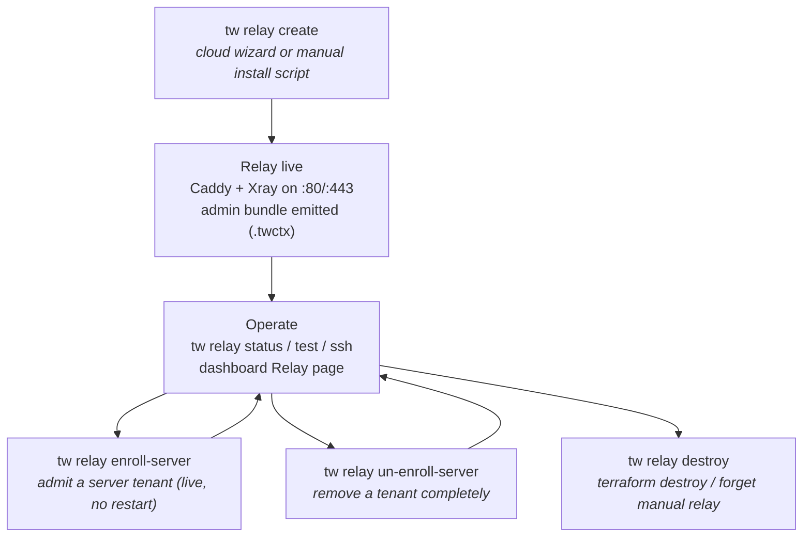

# The Relay Role

The relay is the rendezvous point of every Tunnel Whisperer topology: a small
public VM running **Caddy** (TLS/ACME termination with a mutual-TLS gate) and a
standalone **Xray** (pinned `v26.6.27`), listening only on ports **80** and
**443**. Servers and clients both connect *outbound* to it over HTTPS — no
inbound ports are ever opened on either side — and the relay forwards their
opaque, end-to-end-encrypted streams without ever seeing plaintext.

The **relay admin** is the person (and the `tw` profile, `mode: relay`) that
owns this machine. Creating a relay with `tw relay create` stamps the active
profile as the relay identity; from then on the `tw relay …` command group is
the admin's toolbox.

## What the admin owns

| Asset | Where it lives | What it is |
| ----- | -------------- | ---------- |
| Admin SSH key pair | `<config-dir>/id_ed25519{,.pub}` | The only key that can open a shell on the relay. Tunnel-only by default (see [SSH access](ssh-access.md)). |
| Admin CA + client certificate | `<config-dir>/ca.{crt,key}`, `client.{crt,key}` | The admin's own mTLS admission credentials — the relay trusts one CA per tenant, including the admin's own slot. The CA private key never leaves the admin machine. |
| Server registry | `<config-dir>/servers/*.json` | One JSON file per enrolled server tenant: server-id, UUID, CA cert, SSH public key, allocated port. The relay's entire tenant configuration is re-rendered from this registry on every enroll/un-enroll. |
| Relay state | `<config-dir>/relay/` | Terraform state for cloud relays, or the `manual-relay.json` marker for bring-your-own-VM relays, plus relay metadata (`ssh_open`, instance name). |
| Admin bundle | `tw_<domain-sanitized>.twctx` (dots become dashes: `tw_relay-example-com.twctx`) | The portable relay identity, emitted at create time. **Keep it safe — there is no recovery.** Importing it on another machine makes that machine the relay admin. |

The relay VM itself holds **no signing keys and no user credentials** — only
the *public* CA certificates it verifies client certificates against, rendered
configuration (Caddyfile, Xray `config.json`), and the tw-managed
`authorized_keys` file. Everything on it can be re-rendered from the admin
machine, and the install script can be re-run from scratch.

## Command overview

| Command | What it does |
| ------- | ------------ |
| `tw relay create` | Provision a relay — cloud (Hetzner, DigitalOcean, AWS via Terraform) or manual (bring your own VM). See [Provisioning](provisioning.md). |
| `tw relay destroy` | Tear the relay down (Terraform destroy for cloud; forget + clean up for manual). |
| `tw relay status` | Unified status view: active context, mode, relay provisioning state. |
| `tw relay test` | 3-step diagnostic: DNS → HTTPS/mTLS → Xray + SSH through the tunnel. |
| `tw relay ssh` | Interactive root-capable shell on the relay, through the encrypted tunnel. See [SSH access](ssh-access.md). |
| `tw relay enroll-server <join-request.json>` | Admit a server tenant onto the relay, live and without an Xray restart. See [Tenants](tenants.md). |
| `tw relay get-servers` | List enrolled servers with **live** tunnel state queried from the relay. |
| `tw relay un-enroll-server <server-id> [--yes]` | Completely remove a tenant: block re-auth, sever live connections, rewrite configs, forget the registry entry. |

All of these are gated to the relay mode — a server or client profile cannot
run them.

## Lifecycle

1. **Create** — `tw relay create` provisions the VM (or emits an install
   script for yours), stamps the profile's mode to `relay`, and writes the
   admin bundle.
2. **Operate** — `tw relay test` verifies the full path; `tw relay ssh` and
   the dashboard give day-2 access.
3. **Enroll / un-enroll** — servers join via a join-request/join-response file
   exchange; the admin admits or removes them at any time without disturbing
   other tenants.
4. **Destroy** — `tw relay destroy` removes the infrastructure (saving TLS
   certificates for reuse on cloud relays) and clears the relay from config.

## In this section

- [Provisioning](provisioning.md) — cloud and manual paths, flags,
  `--ssh-open`, the install-script contract, destroying.
- [Tenant management](tenants.md) — enrolling servers, listing them live,
  un-enrolling, isolation guarantees.
- [SSH access](ssh-access.md) — the tunnel-only access model, opening and
  closing port 22, the `authorized_keys` anatomy, troubleshooting.

## Security background

The relay's admission control (mutual TLS against per-tenant CAs) and the
end-to-end encryption model are covered in depth under Security:

- [Relay Authentication (Mutual TLS)](../security/relay-authentication.md)
- [Access Control](../security/access-control.md)
- [Encryption](../security/encryption.md)
