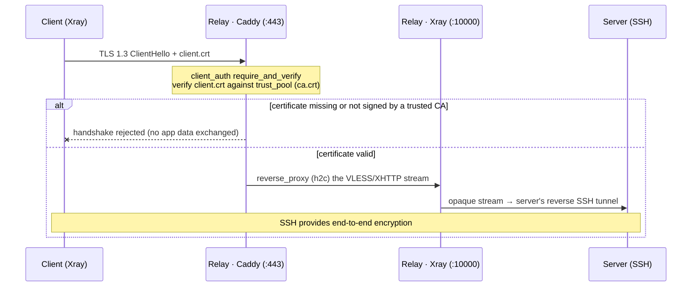

# Relay Authentication (Mutual TLS)

Before any tunnel reaches the relay, it must pass a **mutual-TLS (mTLS)
handshake**. The relay's Caddy front door is configured to *require and verify*
an X.509 client certificate, so a connection that cannot present a certificate
signed by the server's own certificate authority is rejected during the TLS
handshake — before the VLESS protocol, before SSH, before any application byte
is exchanged.

This is the relay's primary admission control. The older VLESS UUID check is
kept as harmless defense-in-depth and is no longer the security boundary.

---

## Why it exists

The relay listens only on `:80`/`:443` and is reachable from the public
internet. Without certificate admission, anyone who discovers the relay can open
TLS sessions to it and probe for UUIDs or SSH usernames. Requiring a client
certificate at the TLS handshake:

- **Shields the relay from unauthenticated traffic.** Connections without a
  valid certificate never get past the handshake, so the VLESS/SSH machinery
  behind Caddy is never exposed to anonymous callers (DoS and probing
  resistance).
- **Anchors trust in a per-server CA.** The relay trusts exactly one
  certificate authority per enrolled server. Only that server (and the clients
  it hands the certificate to) can establish a tunnel.
- **Preserves end-to-end encryption.** mTLS is *admission*, not decryption — the
  relay still forwards opaque streams and never sees plaintext. SSH remains the
  end-to-end layer.

---

## The per-server certificate authority

Each server runs its own small certificate authority. There is **one CA per
server**, and it issues **one client certificate** (common name = the server's
relay host, or `tw-server` if unset) that every client of that server shares.

| Artifact | Curve / validity | Stored at | Leaves the server? |
|---|---|---|---|
| CA certificate (`ca.crt`) | ECDSA P-256, 10 years | `<config-dir>/ca.crt` | **Public cert only** → shipped to the relay trust pool |
| CA private key (`ca.key`) | ECDSA P-256 | `<config-dir>/ca.key` | **Never** |
| Client certificate (`client.crt`) | ECDSA P-256, 5 years, `ExtKeyUsage: clientAuth` | `<config-dir>/client.crt` | Yes — in every user bundle |
| Client private key (`client.key`) | ECDSA P-256 | `<config-dir>/client.key` | Yes — in every user bundle |

The CA and client certificate are generated automatically the first time you run
`tw serve` (the generation is skipped in client mode — clients receive the
certificate from the server). Generation is **idempotent and self-healing**: an
existing CA is never regenerated, but a missing client certificate is re-issued
from the existing CA.

!!! note "One certificate per server, not per user"
    The client certificate authenticates the **server's relay slot**, not the
    individual user. Every user of the same server is handed the same
    `client.crt`/`client.key`. Per-user identity and authorization are enforced
    one layer deeper, by the per-user SSH key and its `permitopen` restrictions
    (see [Access Control](access-control.md)). Keeping admission per-server means
    the relay needs no certificate revocation list — revoking a user is purely an
    SSH-key operation on the server.

---

## How a connection is admitted



1. The client's embedded Xray opens a TLS 1.3 connection to the relay and
   presents `client.crt` during the handshake.
2. Caddy verifies the certificate against its **trust pool** (the server's
   `ca.crt`). If verification fails, the handshake is rejected and nothing
   downstream is touched.
3. On success, Caddy reverse-proxies the VLESS/XHTTP stream to the relay's local
   Xray inbound (`h2c://127.0.0.1:10000`), which carries it to the server's
   reverse SSH tunnel.

---

## Client-side: presenting the certificate

The client's Xray outbound (shared by both `tw serve` and `tw connect`) injects
the certificate into the TLS settings when `client_cert_path`/`client_key_path`
are set:

```json
"tlsSettings": {
  "serverName": "relay.example.com",
  "certificates": [
    {
      "certificateFile": "/etc/tw/config/client.crt",
      "keyFile": "/etc/tw/config/client.key",
      "usage": "client-cert"
    }
  ]
}
```

The paths are **auto-derived at runtime** from `<config-dir>/client.{crt,key}`
when present, so a config bundle works unchanged across machines and
`TW_CONFIG_DIR` values — you rarely set the paths by hand.

!!! note "Requires a recent Xray-core with mutual-TLS support"
    Presenting a client certificate on an *outbound* TLS connection is a recent
    Xray-core capability — older releases only wired server-side certificate
    selection, and the uTLS path used by XHTTP dropped the certificate fields
    entirely. Tunnel Whisperer therefore builds against an Xray-core version that
    includes native mutual-TLS support (the `usage: "client-cert"` certificate
    type, with the `GetClientCertificate` callback carried through to the uTLS
    path).

    This is pinned in `go.mod` to the upstream commit that introduced mTLS and
    **requires Go 1.26**. No fork or patch is involved — the build is a plain
    `go build`. When upstream publishes mTLS in a tagged release, bump the
    `github.com/xtls/xray-core` version; the `usage: "client-cert"` config stays
    as-is.

---

## Relay-side: the Caddy gate

The relay's Caddyfile is rendered by the server at provisioning time and embedded
into the relay's cloud-init (and the manual install script). The TLS block
enforces the mTLS gate for the whole site:

```caddyfile
relay.example.com {
    tls {
        client_auth {
            mode require_and_verify
            trust_pool file /etc/caddy/ca/relay.example.com.crt
        }
        # A single arg to `protocols` sets the minimum, pinning TLS 1.3.
        protocols tls1.3
    }

    @relay.example.com path /tw*
    handle @relay.example.com {
        reverse_proxy h2c://127.0.0.1:10000 {
            flush_interval -1
            stream_close_delay 5m
            transport http {
                versions h2c 1.1
            }
        }
    }
}
```

- **`mode require_and_verify`** — Caddy demands a client certificate on every
  TLS handshake and verifies it against the trust pool.
- **`trust_pool file …`** — the server's CA public certificate(s). The server's
  `ca.crt` is written to `/etc/caddy/ca/<server-id>.crt` on the relay (base64 in
  cloud-init), and Caddy is configured to trust it.
- **`protocols tls1.3`** — TLS 1.3 only.
- **`stream_close_delay 5m`** — holds reverse-proxy streams open for up to five
  minutes across a Caddy reload so long-lived tunnels survive config changes (the
  server's SSH auto-reconnect covers the rest).

!!! info "Per-site, not per-path"
    Caddy's `client_auth` is enforced per-site (per TLS handshake / SNI), not per
    path. In the current single-server design that is exactly right. Routing
    different servers to different upstreams by client-certificate subject is a
    multi-server concern: the data model already carries the seams (a per-server
    handle block, a role tag, and a trust pool keyed by role), but multi-server
    isolation is not yet shipped.

---

## Two credential layers, side by side

| | Client certificate (this page) | SSH key ([Access Control](access-control.md)) |
|---|---|---|
| **Scope** | Per **server** — shared by all its users | Per **user** |
| **Checked by** | Relay's Caddy, at the TLS handshake | Server's embedded SSH server, after the tunnel is up |
| **Purpose** | Admit the connection to the relay | Authenticate the user, restrict forwardable ports |
| **Issued by** | The server's CA (`tw serve`, first run) | The server (`tw create user`) |
| **Revocation** | Re-provision the relay with a new CA | Remove the key from `authorized_keys` (immediate) |

To block a single user, remove their SSH key — the certificate layer is not
involved. To cut off an entire server's relay slot, rotate the CA and
re-provision the relay.

---

## Relationship to the UUID check

The VLESS UUID is still present in the configuration and still matches at the
relay's Xray inbound, but it is now **defense-in-depth, not the security
boundary**. Admission is decided at the TLS handshake by the certificate gate;
an attacker who cannot present a trusted client certificate never reaches the
point where a UUID would be checked.
