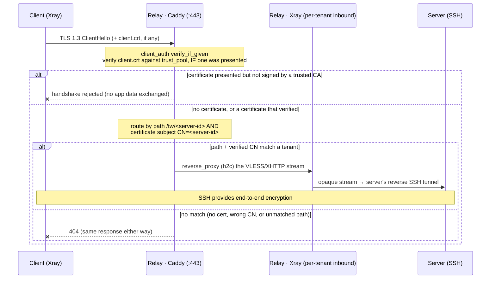

# Relay Authentication (Mutual TLS)

Before any **tunnel** reaches the relay, it must pass a **mutual-TLS (mTLS)
handshake and route match**. The relay's Caddy front door is configured to
*verify if given* an X.509 client certificate: a connection that presents one
must have it signed by an enrolled server's own certificate authority, or the
handshake is rejected outright. A connection that presents **no** certificate
at all still completes the handshake — that's deliberate, so a
not-yet-enrolled invitee can reach the enrollment endpoint — but every
**tunnel** route additionally requires a verified certificate whose subject CN
**and issuing CA** both match that tenant; anything else, certed or not, falls
through to a uniform 404.

This is the relay's primary admission control. The older VLESS UUID check is
kept as harmless defense-in-depth and is no longer the security boundary.

!!! note "Cross-tenant isolation in a shared trust pool"
    On a multi-tenant relay, Caddy admits any certificate that chains to **any**
    enrolled CA in its trust pool, then each tenant route matches on the
    certificate. Matching the subject CN alone would let one tenant mint a
    certificate carrying another tenant's CN off its **own** (pool-trusted) CA
    and reach the victim's upstream. Two checks close that: each route requires
    the certificate's **issuer** to be that tenant's CA (`CN=<server-id>`, since
    every per-server CA's subject is its own server-id), and enrollment refuses
    a joining server whose submitted CA subject does not equal its server-id —
    so no tenant can register a CA that impersonates another's identity.

---

## Why it exists

The relay listens only on `:80`/`:443` and is reachable from the public
internet. Without certificate-gated routing, anyone who discovers the relay
could reach the VLESS/SSH machinery behind Caddy and probe for UUIDs or SSH
usernames. Route-gating every tenant handle on a verified client certificate:

- **Shields the relay's tunnels from unauthenticated traffic.** A connection
  without a valid, matching certificate never reaches a tenant's VLESS
  inbound — it falls through to a uniform 404, same response whether the path
  is wrong, the certificate is missing, or the certificate doesn't match that
  tenant (DoS and probing resistance). The one deliberate exception is the
  enrollment endpoint, which a bare handshake can reach — that's the surface
  `tw relay invite` needs, and it's a short-lived, single-use code behind it,
  not open tunnel access.
- **Anchors trust in a per-server CA.** The relay trusts exactly one
  certificate authority per enrolled server. Only that server (and the clients
  it hands the certificate to) can establish a tunnel — and only to that
  server's own route.
- **Preserves end-to-end encryption.** mTLS is *admission*, not decryption — the
  relay still forwards opaque streams and never sees plaintext. SSH remains the
  end-to-end layer.

---

## The per-server certificate authority

Each server runs its own small certificate authority. There is **one CA per
server**, and every client certificate it issues carries the same common name
— the **server-id** (`<hostname>-<first 8 hex of the profile UUID>`) — since
that's what the relay's per-tenant route matcher checks. How the certificate
reaches a client differs by path:

| Artifact | Curve / validity | Stored at | Leaves the server? |
|---|---|---|---|
| CA certificate (`ca.crt`) | ECDSA P-256, 10 years, CN = server-id | `<config-dir>/ca.crt` | **Public cert only** → shipped to the relay trust pool (`/etc/caddy/ca/<server-id>.crt`) |
| CA private key (`ca.key`) | ECDSA P-256 | `<config-dir>/ca.key` | **Never** |
| Server's own client certificate (`client.crt`) | ECDSA P-256, 5 years, CN = server-id, `ExtKeyUsage: clientAuth` | `<config-dir>/client.crt` | Only its **public** half — presented by `tw server start` itself, never handed to a client |
| Server's own client private key (`client.key`) | ECDSA P-256 | `<config-dir>/client.key` | **Never** |
| An invited client's certificate | ECDSA P-256, 5 years, CN = server-id (forced by the signer, ignoring the CSR's requested subject), `ExtKeyUsage: clientAuth` | Client's own config dir | N/A — issued directly to the client from *their* CSR; the matching private key is generated on the client and never existed on the server |

The CA is generated automatically the first time a server or relay profile
initializes (any `tw` command that touches ops — e.g. `tw server start`, `tw
relay create`); generation is skipped in client mode. Generation is
**idempotent and self-healing**: an existing CA is never regenerated, and if
the server-id changes (hostname or UUID change) certificates are re-issued to
match.

!!! note "Same CN, but no longer one shared keypair"
    Every certificate issued by a server's CA carries that server's CN, so
    the relay's route matcher treats all of a server's clients — and the
    server itself — identically: admission and routing are per-**server**,
    not per-user. What changed with invite-based enrollment is the *key
    material*: `tw server user invite` signs each client's own CSR
    (`internal/pki.SignClientCSR`), so every invited client holds a distinct
    keypair with a certificate the server never possessed the private half
    of. Per-user identity and authorization are enforced one layer deeper
    regardless, by the per-user SSH key and its `permitopen` restrictions
    (see [Access Control](access-control.md)). Keeping admission per-server
    means the relay still needs no certificate revocation list — revoking a
    user is purely an SSH-key operation on the server, and revoking a whole
    server is `tw relay un-enroll-server`, which drops its CA from the trust
    pool (invalidating every certificate it ever issued, in one step).

---

## How a connection is admitted


```mermaid
sequenceDiagram
    participant C as Client (Xray)
    participant Caddy as Relay · Caddy (:443)
    participant X as Relay · Xray (per-tenant inbound)
    participant S as Server (SSH)

    C->>Caddy: TLS 1.3 ClientHello (+ client.crt, if any)
    Note over Caddy: client_auth verify_if_given<br/>verify client.crt against trust_pool, IF one was presented
    alt certificate presented but not signed by a trusted CA
        Caddy--xC: handshake rejected (no app data exchanged)
    else no certificate, or a certificate that verified
        Note over Caddy: route by path /tw/#lt;server-id#gt; AND<br/>certificate subject CN=#lt;server-id#gt;
        alt path + verified CN match a tenant
            Caddy->>X: reverse_proxy (h2c) the VLESS/XHTTP stream
            X->>S: opaque stream → server's reverse SSH tunnel
            Note over C,S: SSH provides end-to-end encryption
        else no match (no cert, wrong CN, or unmatched path)
            Caddy--xC: 404 (same response either way)
        end
    end
```

1. The client's embedded Xray opens a TLS 1.3 connection to the relay and
   presents `client.crt` during the handshake.
2. Caddy verifies a *presented* certificate against its **trust pool** (the
   union of all enrolled servers' `ca.crt` files) — a certificate that fails
   verification is rejected at the handshake, but presenting none at all is
   allowed, so an invitee with no certificate yet can still reach `/enroll`.
3. Every **tunnel** route additionally requires a match: the XHTTP path
   (`/tw/<server-id>`) **and** the certificate subject (`CN=<server-id>`) must
   agree. A valid certificate for server A cannot reach
   server B's upstream.
4. On a match, Caddy reverse-proxies the stream to that server's local Xray
   inbound (`h2c://127.0.0.1:<remote-port + 10000>`), which carries it to the
   server's reverse SSH tunnel. Anything that doesn't match a tenant route —
   no certificate, a wrong CN, or an unrecognized path — falls through to the
   same uniform 404, so a probe can't distinguish "wrong certificate" from
   "no such tenant."

---

## Client-side: presenting the certificate

The client's Xray outbound (shared by both `tw server start` and `tw client
connect`) injects the certificate into the TLS settings when
`client_cert_path`/`client_key_path` are set:

```json
"tlsSettings": {
  "serverName": "relay.example.com",
  "certificates": [
    {
      "certificateFile": "/etc/tw/config/client.crt",
      "keyFile": "/etc/tw/config/client.key",
      "usage": "client-cert"
    }
  ]
}
```

The paths are **auto-derived at runtime** from `<config-dir>/client.{crt,key}`
when present, so a config bundle works unchanged across machines and
`TW_CONFIG_DIR` values — you rarely set the paths by hand.

!!! note "Requires a recent Xray-core with mutual-TLS support"
    Presenting a client certificate on an *outbound* TLS connection is a recent
    Xray-core capability — older releases only wired server-side certificate
    selection, and the uTLS path used by XHTTP dropped the certificate fields
    entirely. Tunnel Whisperer therefore builds against an Xray-core version that
    includes native mutual-TLS support (the `usage: "client-cert"` certificate
    type, with the `GetClientCertificate` callback carried through to the uTLS
    path).

    This is pinned in `go.mod` to the upstream commit that introduced mTLS and
    **requires Go 1.26**. No fork or patch is involved — the build is a plain
    `go build`. When upstream publishes mTLS in a tagged release, bump the
    `github.com/xtls/xray-core` version; the `usage: "client-cert"` config stays
    as-is.

---

## Relay-side: the Caddy gate

The relay's Caddyfile is rendered by `tw` and installed at provisioning time
(embedded in cloud-init or the manual install script) and **re-rendered,
validated, and gracefully reloaded on every enroll/un-enroll**. The TLS block
enforces the mTLS gate for the whole site; one handle block per enrolled
server routes by certificate subject:

```caddyfile
relay.example.com {
    tls {
        client_auth {
            # verify_if_given: enrollees have no client cert yet, so the
            # /enroll routes must admit a bare TLS handshake. Presented certs
            # are still verified against the trust pool, and every tunnel
            # route below requires a verified CN — no cert, no tunnel.
            mode verify_if_given
            trust_pool file /etc/caddy/ca/srv1-1a2b3c4d.crt /etc/caddy/ca/srv2-5e6f7a8b.crt
        }
        # TLS 1.3 only: a single arg to `protocols` sets the minimum, pinning 1.3.
        protocols tls1.3
    }

    @srv1-1a2b3c4d {
        path /tw/srv1-1a2b3c4d*
        expression {http.request.tls.client.subject} == "CN=srv1-1a2b3c4d"
    }
    handle @srv1-1a2b3c4d {
        reverse_proxy h2c://127.0.0.1:30000 {
            flush_interval -1
            stream_close_delay 5m
            transport http {
                versions h2c 1.1
                keepalive 120s
                keepalive_idle_conns 32
            }
        }
    }
    @enroll_srv1-1a2b3c4d path /enroll/srv1-1a2b3c4d/*
    handle @enroll_srv1-1a2b3c4d {
        reverse_proxy 127.0.0.1:40000
    }

    # ...one matcher + handle pair per enrolled server...

    handle {
        respond 404
    }
    handle_errors {
        respond 404
    }
}
```

- **`mode verify_if_given`** — Caddy verifies a client certificate against the
  trust pool *if one is presented*, but a bare handshake with no certificate
  is allowed. This is what lets `tw join` reach `/enroll/<tok>` before it has
  a certificate to present.
- **`trust_pool file …`** — the public CA certificate of every enrolled server,
  written to `/etc/caddy/ca/<server-id>.crt` on the relay.
- **`protocols tls1.3`** — TLS 1.3 only.
- **`@enroll_<server-id>` matcher** — routes a tenant's `/enroll/<tok>/*` path
  to its local invite listener (the port `tw relay invite` / `tw server user
  invite` opens over the tenant's own reverse SSH tunnel), no
  certificate required — the one-time code and SAS read-back are the gate
  here, not TLS.
- **`@<server-id>` matcher** — path *and* client-certificate subject must both
  name the same server, isolating tenants from each other on a shared relay.
- **`stream_close_delay 5m`** — holds reverse-proxy streams open for up to five
  minutes across a Caddy reload so long-lived tunnels survive config changes
  (enrolling a new server reloads Caddy gracefully; the SSH auto-reconnect
  covers the rest).
- Unmatched requests get a plain `404`.

---

## Two credential layers, side by side

| | Client certificate (this page) | SSH key ([Access Control](access-control.md)) |
|---|---|---|
| **Scope** | Per **server** — every certificate a server's CA issues carries the same CN, whether or not the keypair behind it is shared | Per **user** |
| **Checked by** | Relay's Caddy, at the TLS handshake | Server's embedded SSH server, after the tunnel is up |
| **Purpose** | Admit the connection to the relay and route it to the right server | Authenticate the user, restrict forwardable ports |
| **Issued by** | The server's CA (automatic, first profile init) | The server (`tw server user invite`) |
| **Revocation** | `tw relay un-enroll-server` (removes the CA from the trust pool) | Remove the key from `authorized_keys` (immediate — re-read every auth) |

To block a single user, remove their SSH key — the certificate layer is not
involved. To cut off an entire server's relay slot, un-enroll it from the
relay.

---

## Relationship to the UUID check

The VLESS UUID is still present in the configuration and still matches at the
relay's per-tenant Xray inbound, but it is now **defense-in-depth, not the
security boundary**. Admission to a tunnel is decided by the certificate gate
— at the handshake for an invalid certificate, at the route match for a
missing or mismatched one; an attacker who cannot present a trusted,
matching client certificate never reaches the point where a UUID would be
checked.
